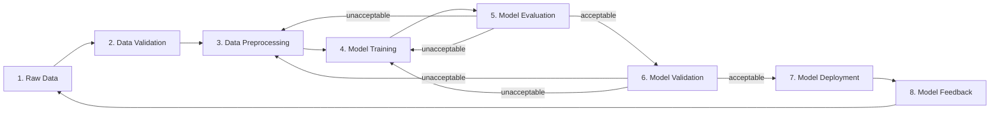

# Architecture — VESTA
(Vietnamese Equity Sentiment-Triggered Agent)

## What is this system?

VESTA is a research-first pipeline that scores Vietnamese-language financial
news for sentiment, cross-checks that signal against company fundamentals
and macro context, and — only after the signal is proven on historical data
and a compliance check is cleared — would route trades through a Vietnamese
brokerage API. As of this writing, the system stops at the "prove the signal
and serve read-only inference" stage; the execution layer (`execution/`) is
scaffolded but blocked (see `DECISIONS.md` and `feature_list.json` F901/F902).

The core bet: Vietnamese retail-dominated equity markets show short-term
sentiment overreaction that partially reverts within ~30 days. VESTA exists
to test that claim cheaply before building anything that touches real
capital.

## Agent roles on this project (non-obvious, worth stating explicitly)

- **Gemini (chat)** — primary AI research: literature review, data-source
  investigation, statistical design, interpreting backtest results.
- **Gemini Antigravity** — primary AI coding agent: implements features from
  `feature_list.json`, writes/runs tests, follows `AGENTS.md` workflow.
- **Claude** — secondary: used for harness/documentation upkeep, code review,
  and cross-checking decisions against `conventions.md` / `DECISIONS.md`.
- Progress logs are kept **separate per agent** (`claude-progress.md`,
  `gemini-progress.md`) specifically so two agents working in different
  sessions don't overwrite each other's notes — always read both before
  starting work, even if only one matches your identity.

## How is it organized? (folder map)

Every file below should carry a one-line docstring/header restating this
description — treat this tree as the source of truth for what belongs where.

```
vesta/
├── AGENTS.md                  Routing manual — read first, every session.
├── DECISIONS.md               Log of deliberate, non-obvious choices.
├── conventions.md             Style/pattern rules with source + expiry.
├── verification.md            Copy-paste pass/fail commands for this repo.
├── feature_list.json          The single source of truth for what's done.
├── claude-progress.md         Session log — Claude sessions only.
├── gemini-progress.md         Session log — Gemini / Antigravity sessions.
├── init.sh                    Bootstrap: install → test → build → confirm.
│
├── crawlers/                  Stage F0xx — one module per data source.
│   ├── vnstock_market.py      OHLCV + reference data (F001).
│   ├── vnstock_fundamental.py Balance sheet / income / cash flow (F002).
│   ├── vnstock_ta_macro.py    TA indicators + macro series, vintaged (F003).
│   ├── vnstock_news.py        vnstock News module crawler (F004).
│   └── cafef_news.py          cafef.vn scraper, secondary news source (F005).
│
├── pipeline/                  Stage F1xx-F2xx — validation, joins, backtest.
│   ├── validate.py            Schema gate — the only place bad data halts
│   │                          the pipeline loudly (F101).
│   ├── pit_join.py            Point-in-time correct news+price join, no
│   │                          look-ahead leakage (F102).
│   └── backtest_meanreversion.py
│                              The proof backtest — rule-based scorer first,
│                              PhoBERT scorer second (F201, F302).
│
├── models/                    Stage F3xx — SLM fine-tuning + eval.
│   ├── train_sentiment.py     PhoBERT-base fine-tune, VRAM-budgeted (F301).
│   └── evaluate.py            Held-out F1 / threshold check.
│
├── service/                   Stage F4xx — deployment (read-only, no orders).
│   ├── inference_api.py       Local FastAPI: headline in, sentiment +
│   │                          fundamentals out (F401).
│   └── feedback_log.py        Logs predictions, back-fills realized
│                              returns for drift monitoring (F402).
│
├── execution/                 Stage F9xx — BLOCKED. Do not implement past
│   │                          stub interfaces until F901 is `passing`.
│   └── broker_client.py       OAuth2/PKCE client stub, sandbox-only.
│
├── configs/                   YAML configs (model hyperparams, ticker
│                              universe, TTL policies) — no secrets here.
├── data/                      Local Parquet lake (gitignored). Partitioned
│                              by source/ticker/year.
├── out/                       Backtest reports, eval reports (gitignored
│                              except example fixtures).
└── tests/                     Mirrors the module tree 1:1 — every module
                               above has a matching test_<module>.py.
```

## How do I run it locally?

```bash
./init.sh                       # install deps, run tests, confirm env healthy
python -m crawlers.vnstock_market --tickers configs/vn30.yaml
python -m pipeline.validate --all
python -m pipeline.backtest_meanreversion --report out/meanreversion_report.json
```
Exact commands and their pass/fail meaning live in `verification.md` — this
section is a quick-start, not the authority.

## Key conventions that aren't obvious from the code itself

- Every crawler writes Parquet, never CSV in the data lake (CSV is fine for
  `out/` human-readable reports only) — see `conventions.md`.
- No feature in `pipeline/` or `models/` may read `execution/` — the
  dependency only goes one direction, enforced by import-linter in CI.
- Hardware budget is fixed: RTX 3060 6GB VRAM, 16GB system RAM. Any model
  config must state its expected VRAM/RAM footprint in `configs/`.

## Machine Learning Pipeline Lifecycle (8-Stage Loop)



1. **Stage 1: Raw Data** `[COMPLETE]`: Master company registry, daily OHLCV bars (5.17M rows), multi-source financial news (658K events), quarterly financial statements, and corporate action events in DuckDB lakehouse.
2. **Stage 2: Data Validation** `[CURRENT WORK / IN QUEUE]`: Cross-dataset referential integrity (F101) + Enterprise 7-Dimension Data Quality Auditor (F103) with zero look-ahead bias audit.
3. **Stage 3: Data Preprocessing** `[QUEUED]`: Point-in-time multi-source alignment (F102), NLP lexical scoring, backward-looking technical indicators, fundamental ratios extraction, forward return targets, and temporal Train/Val/Test splitting (F104).
4. **Stage 4: Model Training** `[QUEUED]`: Baseline statistical / supervised ML models and fine-tuned PhoBERT-base Vietnamese financial sentiment models (F201/F301).
5. **Stage 5: Model Evaluation** `[QUEUED]`: Statistical significance, Cohen's d effect size, paired t-test, Sharpe ratio, and error analysis. If unacceptable, loops back to Preprocessing or Training.
6. **Stage 6: Model Validation** `[QUEUED]`: Out-of-sample temporal holdout testing and macro regime stress tests. If unacceptable, loops back to Preprocessing or Training.
7. **Stage 7: Model Deployment** `[QUEUED]`: Read-only local FastAPI inference microservice (F401).
8. **Stage 8: Model Feedback** `[QUEUED]`: Prediction logging, realized return tracking, concept/data drift monitoring, feeding telemetries back into raw data lake (F402).

