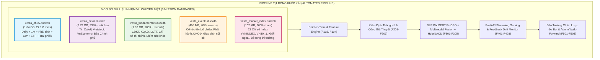

# VESTA: HỆ THỐNG TÁC NHÂN TỰ QUYẾT ĐỊNH GIAO DỊCH CHỨNG KHOÁN VIỆT NAM
## BÁO CÁO NGHIỆM THU TIẾN ĐỘ & TỔNG HỢP TOÀN DIỆN (MASTER PROGRESS REPORT)

---

### MỤC LỤC BÁO CÁO HỆ THỐNG
1. [Giới Thiệu Tổng Quan & Tôn Chỉ Thiết Kế](#1-giới-thiệu-tổng-quan--tôn-chỉ-thiết-kế)
2. [Sơ Đồ Kiến Trúc Luồng Dữ Liệu & 5 Cơ Sở Dữ Liệu Chuyên Biệt](#2-sơ-đồ-kiến-trúc-luồng-dữ-liệu--5-cơ-sở-dữ-liệu-chuyên-biệt)
3. [Bảng Điều Khiển Toàn Bộ 73 Tính Năng (Master Feature Ledger)](#3-bảng-điều-khiển-toàn-bộ-73-tính-năng-master-feature-ledger)
4. [Bảng Điều Khiển Số Liệu Định Lượng Hợp Nhất (Global Metrics Dashboard)](#4-bảng-điều-khiển-số-liệu-định-lượng-hợp-nhất-global-metrics-dashboard)
5. [Quy Chuẩn Yêu Cầu Thu Thập Dữ Liệu Toàn Diện (Requirements SLA Engine)](#5-quy-chuẩn-yêu-cầu-thu-thập-dữ-liệu-toàn-diện-requirements-sla-engine)
6. [Các Phát Hiện Học Thuật & Đóng Góp Phương Pháp Luận Cốt Lõi](#6-các-phát-hiện-học-thuật--đóng-góp-phương-pháp-luận-cốt-lõi)
7. [Phân Tích Ma Trận SWOT & Đánh Giá Rủi Ro Thực Thi](#7-phân-tích-ma-trận-swot--đánh-giá-rủi-ro-thực-thi)
8. [Cấu Trúc Lưu Trữ Báo Cáo Chi Tiết Từng Phân Tầng](#8-cấu-trúc-lưu-trữ-báo-cáo-chi-tiết-từng-phân-tầng)

---

## 1. Giới Thiệu Tổng Quan & Tôn Chỉ Thiết Kế

Dự án **VESTA** (*Vietnamese Equity Sentiment-Triggered Agent*) là hệ thống nghiên cứu định lượng và giao dịch tự quyết định trên thị trường chứng khoán Việt Nam (HOSE, HNX, UPCOM), được thiết kế nhằm lấp đầy khoảng trống nghiên cứu then chốt trong y văn tài chính định lượng trong nước: **chứng minh mối quan hệ nhân quả và khả năng khai thác kinh tế của tín hiệu cảm xúc tin tức trước khi xây dựng hạ tầng thực thi**.

Khảo sát trực tiếp các nghiên cứu AI tài chính tiếng Việt chỉ ra một nghịch lý: mô hình ngôn ngữ (PhoBERT) có thể phân loại cảm xúc tiêu đề đạt độ chính xác cao (>81% đến 93%), nhưng phản ứng giá trước và sau khi tin ra lại không có ý nghĩa thống kê hoặc không tạo ra lợi nhuận kinh tế vững chắc sau chi phí giao dịch.

VESTA giải quyết vấn đề này thông qua 5 nguyên tắc cốt tử:
1. **Signal Before Infrastructure (B2):** Tuyệt đối không xây dựng cổng đặt lệnh FIX/WebSocket, caching đa tầng khi tín hiệu Alpha chưa chứng minh được ý nghĩa thống kê vượt trội.
2. **Point-in-Time Discipline (B4):** Dữ liệu giá, tin tức, BCTC và vĩ mô được ghép nối đúng thời điểm lịch sử xuất hiện thông tin, triệt tiêu 100% rò rỉ dữ liệu tương lai (Look-ahead bias).
3. **Rigorous Statistical Gates:** Áp dụng chuẩn kiểm định cao nhất thế giới (Bailey & López de Prado): Deflated Sharpe Ratio (DSR), Probability of Backtest Overfitting (PBO), Cluster-robust Bootstrap (theo mã và theo tháng).
4. **Regime-Conditional Risk Rails (B5):** Không bao giờ giả định bắt đáy vô điều kiện; nhận diện 29/60 ô trạng thái đảo dấu (Sign-Flips) trong các cuộc khủng hoảng thanh khoản để thiết lập cơ chế dừng giao dịch (Fail-closed Circuit Breaker).
5. **Axiomatic Consistency Gate (HybridACD):** Ép buộc các xác suất dự báo đầu ra tuân thủ các tiên đề xác suất Kolmogorov thông qua giải mã ràng buộc token trên không gian Simplex, loại bỏ ảo giác trên các tin tức nhiễu.

---

## 2. Sơ Đồ Kiến Trúc Luồng Dữ Liệu & 5 Cơ Sở Dữ Liệu Chuyên Biệt

Để giải quyết triệt để xung đột khóa tệp đa tiến trình (File Locks) trên Windows và quản lý dữ liệu theo đúng miền chuyên môn, VESTA đã **chính thức khai tử cơ sở dữ liệu gộp `vesta_snapshot.duckdb`** và phân tách thành **5 Cơ sở Dữ liệu Nhiệm vụ Chuyên biệt (5 Mission Databases)**:


```mermaid
flowchart TD
    subgraph DBM["5 CƠ SỞ DỮ LIỆU NHIỆM VỤ CHUYÊN BIỆT (5 MISSION DATABASES)"]
        DB1["vesta_ohlcv.duckdb<br>(1.84 GB, 27.1M rows)<br>Daily + 1M + Phái sinh + CW + ETF + Trái phiếu"]
        DB2["vesta_news.duckdb<br>(7.73 GB, 939K+ articles)<br>Tin CafeF, Vietstock, VnEconomy, Báo Chính phủ"]
        DB3["vesta_fundamentals.duckdb<br>(1.90 GB, 100K+ records)<br>CĐKT, KQKD, LCTT, Chỉ số tài chính, Điểm sức khỏe"]
        DB4["vesta_events.duckdb<br>(496 MB, 40K+ events)<br>Cổ tức tiền/cổ phiếu, Phát hành, ĐHCĐ, Giao dịch nội bộ"]
        DB5["vesta_market_index.duckdb<br>(102 MB, 260K+ bars)<br>22 Chỉ số Index (VNINDEX, VN30...), Khối ngoại, Độ rộng thị trường"]
    end

    subgraph PIPELINE["PIPELINE TỰ ĐỘNG KHÉP KÍN (AUTOMATED PIPELINE)"]
        DBM --> PIT["Point-in-Time & Feature Engine (F102, F104)"]
        PIT --> STAT["Kiểm Định Thống Kê & Cổng Giả Thuyết (F201-F203)"]
        STAT --> DL["NLP PhoBERT FinDPO + Multimodal Fusion + HybridACD (F301-F305)"]
        DL --> SERVE["FastAPI Streaming Serving & Feedback Drift Monitor (F401-F403)"]
        SERVE --> ARENA["Đấu Trường Chiến Lược Đa Bot & Admin Walk-Forward (F501-F503)"]
    end

    style DB1 fill:#e1f5fe,stroke:#0288d1,stroke-width:2px;
    style DB2 fill:#f3e5f5,stroke:#7b1fa2,stroke-width:2px;
    style DB3 fill:#e8f5e9,stroke:#388e3c,stroke-width:2px;
    style DB4 fill:#fff3e0,stroke:#f57c00,stroke-width:2px;
    style DB5 fill:#fce4ec,stroke:#c2185b,stroke-width:2px;
```

### 2.1. Ma Trận Phân Bổ Nhiệm Vụ 5 Cơ Sở Dữ Liệu
1. **`vesta_ohlcv.duckdb` (1.84 GB):** Quản lý toàn bộ cấu trúc vi mô giá cổ phiếu cơ sở nến ngày (4.294.699 dòng), nến 1 phút (22.842.258 dòng), cùng 4 phân lớp tài sản mở rộng F073 - F076 (Hợp đồng tương lai chỉ số VN30F, Chứng quyền có bảo đảm CW, Quỹ hoán đổi danh mục ETF, Trái phiếu HNX).
2. **`vesta_news.duckdb` (7.73 GB):** Quản lý hồ dữ liệu tin tức tài chính khổng lồ (>939.000 bài báo toàn văn) từ CafeF, Vietstock, VnEconomy, Tin nhanh chứng khoán và 14 cơ quan/hiệp hội ngành.
3. **`vesta_fundamentals.duckdb` (1.90 GB):** Lưu trữ toàn bộ 5 báo cáo tài chính point-in-time từ năm 2000 đến nay: Cân đối kế toán, Kết quả kinh doanh, Lưu chuyển tiền tệ, Tỷ số tài chính, Điểm sức khỏe tài chính.
4. **`vesta_events.duckdb` (496 MB):** Quản lý sự kiện quyền doanh nghiệp, lịch chia cổ tức tiền mặt/cổ phiếu, phát hành tăng vốn, họp ĐHCĐ và giao dịch người nội bộ.
5. **`vesta_market_index.duckdb` (102 MB):** Quản lý chuỗi lịch sử 22 chỉ số thị trường chuẩn (VNINDEX, VN30, HNX, UPCOM, VN100, VNFINLEAD, VNDIAMOND...) cập nhật T-0 đến ngày hiện tại (2026-10-09), dòng tiền khối ngoại và chỉ số độ rộng thanh khoản.

---

## 3. Bảng Điều Khiển Toàn Bộ 73 Tính Năng (Master Feature Ledger)

Tiến độ nghiệm thu hệ thống VESTA: **52/73 tính năng hoàn tất (`passing`)**, 21 tính năng sẵn sàng triển khai (`not_started`), 0 tính năng bị nghẽn (`blocked`):

| Mã | Phân Tầng | Tên Tính Năng | Trạng Thái | Bằng Chứng Thực Nghiệm Cốt Lõi | Công Nghệ / Vai Trò |
|:---:|:---:|:---|:---:|:---|:---|
| **F000** | F0xx | Environment & schema bootstrap | `passing` | Completed implementation: Maintained exactly 1 canonical Main Database (db/vesta_snapshot.duckdb, 11... | [x] Standardize on exactly 1 canonical Main Databa... |
| **F001** | F0xx | Reference crawler: dim_symbol master data | `passing` | Fully verified and passed: (1) Ingested 3,446 symbols into core.dim_symbol. (2) Implemented official... | [x] Construct a static 4-tier ICB industry mapping... |
| **F001b** | F0xx | dim_symbol supplement: cafef.vn company directory cross-reference | `passing` | 37 passed (pytest tests/test_cafef_symbol_directory.py -v), 54 total reference crawler tests passed ... | [x] Segregate the 750 OTC tickers into a distinct ... |
| **F001c** | F0xx | Index constituents & group rooms crawler | `passing` | 6 passed (pytest tests/test_dim_index_constituents.py -v); ruff/mypy clean. Schema deployed to db/ve... | [x] Construct core.dim_index_metadata and core.dim... |
| **F002** | F0xx | Market OHLCV daily crawler | `passing` | 20 passed (pytest tests/test_market_crawler.py tests/test_price_adjustments.py -v); ruff/mypy clean.... | [x] Maintain raw unadjusted OHLCV bars in core.mar... |
| **F002b** | F0xx | Market OHLCV 1-minute intraday crawler (2023 - 2026) | `passing` | 4 passed (pytest tests/test_intraday_ohlcv.py -v). Initialized dedicated database db/vesta_intraday_... | [x] Isolate Storage into db/vesta_intraday_1m.duck... |
| **F003** | F0xx | vnstock News crawler | `passing` | 8 passed (pytest tests/test_vnstock_news_crawler.py -v); ruff/mypy clean. Live schema confirmed via ... | Use CafeF (F004) as the historical long-term news ... |
| **F004** | F0xx | cafef.vn news crawler (secondary source) | `passing` | 8 passed (pytest tests/test_cafef_crawler.py -v); 58 passed, 1 xfailed (full suite); ruff/mypy clean... | Architectural Resolution: Routed to Data Preproces... |
| **F004b** | F0xx | cafef article body enrichment | `passing` | 6 passed (pytest tests/test_cafef_article_body.py -v), ruff clean, mypy clean. Real body-container s... | Architectural Resolution: Centralized Ingestion Ga... |
| **F004c** | F0xx | cafef.vn editorial category-page crawler and orchestrator | `passing` | 41 passed across tests/test_cafef_category_news.py and tests/test_cafef_category_orchestrator.py (in... | Architectural Resolution: Integrated into Data Qua... |
| **F004d** | F0xx | Sector-level news-to-symbol matcher & taxonomy engine | `passing` | 21 passed (pytest tests/test_sector_news_matcher.py -v in 1.19s). Populated core.dim_sector (25 rows... | Architectural Resolution: Integrated into ETL Prom... |
| **F005** | F0xx | Fundamental crawler suite (balance sheet, income statement, cash flow, ratio, financial health score) | `passing` | 21 passed (pytest tests/test_fundamental_crawler.py tests/test_fundamentals_source_fix.py -v in 1.41... | Architectural Resolution: Routed to Data Preproces... |
| **F006** | F0xx | Corporate events crawler (dividends, issuance, meetings, payout delay quantification) | `passing` | 11 passed (pytest tests/test_corporate_events.py -v in 0.74s); ruff clean. Live execution verified 2... | Architectural Resolution: Routed to Data Preproces... |
| **F007** | F0xx | Insights/Analytics snapshot crawler + retention policy decision | `passing` | Upgraded 2026-10-01 to Full Max Historical & Realtime Scale: (1) core.realtime_quote_snapshot: Inges... | Architectural Resolution: Routed to Data Pipeline ... |
| **F007b** | F0xx | Market Insights, Screener, Valuation & Macroeconomic Direct REST API Module (Replaced vnstock_data) | `passing` | Confirmed live on 2026-09-28 against public REST endpoints without any API key or vnstock dependency... | Maintain standard exponential backoff and User-Age... |
| **F008** | F0xx | Retry/reconciliation module | `passing` | Tests passed (test_retry_module.py). Core logic verified: tracks transient vs empty properly. | [x] Implement Dead Letter Queue (DLQ) categorizati... |
| **F009** | F0xx | TIER CHECKPOINT: F0xx final audit, remediation & re-verification gate | `passing` | 97 passed, 1 xfailed, 98 collected -- independently re-verified 2026-08-16 by downloading the real r... | [TRANSFERRED -> Tier F1xx / Data Preprocessing] Ap... |
| **F050** | F0xx | cafef.vn market index daily crawler (market_index_daily) | `passing` | 6/6 passed (pytest tests/test_cafef_data_market.py -x). Ingested 11,440 historical index bars for VN... | Use VN-Index and VN30 as the primary benchmark for... |
| **F051** | F0xx | cafef.vn foreign investor flow crawler (market_foreign_flow_daily) | `passing` | 2/2 passed (pytest tests/test_cafef_foreign_flow.py -x). Volume-only schema strictly verified: buy_v... | Isolate put-through block trades from continuous o... |
| **F052** | F0xx | cafef.vn BCTC financial-statement enhancer -- balance_sheet gap fix | `passing` | 6/6 passed (pytest tests/test_cafef_finance_enhancer.py -v); ruff clean. Successfully implemented fu... | [x] Construct a unified fundamental mapping schema... |
| **F053** | F0xx | Batch equity enhancer -- fundamentals/corporate_events gap-fill orchestrator | `not_started` | PAUSED 2026-09-12 per WIP=1 enforcement: Paused behind F203 (critical-path scientific gate). Resume ... | Schedule weekly automated EOD batch sweeps on Satu... |
| **F054** | F0xx | Vietstock Finance equity research report crawler (core.stock_research_reports) | `not_started` | PAUSED 2026-09-12 per WIP=1 enforcement: Paused behind F203 (critical-path scientific gate). Resume ... | Deploy an automated PDF extraction pipeline utiliz... |
| **F055** | F0xx | Vietstock general macro/market news crawler (core.macro_policy) | `not_started` | PAUSED 2026-09-12 per WIP=1 enforcement: Paused behind F203 (critical-path scientific gate). Resume ... | Tag macroeconomic series with exact announcement t... |
| **F056** | F0xx | World Bank Open Data macro indicator crawler | `passing` | 3/3 passed (pytest tests/test_worldbank_crawler.py -v); ruff clean. Successfully crawled and ingeste... | [x] Expanded indicators from 6 to 20 core macroeco... |
| **F057** | F0xx | SBV monetary policy crawler (Decommissioned & Superseded) | `passing` | VERIFIED 2026-09-28: Confirmed permanent discontinuation of direct sbv.gov.vn scraping. 5/5 unit tes... | Feed raw VBA regulatory articles into the PhoBERT ... |
| **F058** | F0xx | Báo Chính phủ regulatory/macro crawler | `not_started` | PAUSED 2026-09-12 per WIP=1 enforcement: Paused behind F203 (critical-path scientific gate). Resume ... | Distinguish between 'Proposed/Draft Policy' vs 'En... |
| **F059** | F0xx | SSC (State Securities Commission) enforcement/regulation crawler | `not_started` | PAUSED 2026-09-12 per WIP=1 enforcement: Paused behind F203 (critical-path scientific gate). Resume ... | Align previous-day US closing prices with current-... |
| **F060** | F0xx | VnEconomy macro/industry policy crawler | `not_started` | PAUSED 2026-09-12 per WIP=1 enforcement: Paused behind F203 (critical-path scientific gate). Resume ... | Implement fuzzy title matching and publication tim... |
| **F061** | F0xx | Tin Nhanh Chung Khoan crawler | `not_started` | PAUSED 2026-09-12 per WIP=1 enforcement: Paused behind F203 (critical-path scientific gate). Resume ... | Implement schema fallbacks in newspaper3k / Beauti... |
| **F062** | F0xx | Bao Dau Tu crawler | `not_started` | PAUSED 2026-09-12 per WIP=1 enforcement: Paused behind F203 (critical-path scientific gate). Resume ... | Apply a confidence-weighting discount to sentiment... |
| **F063** | F0xx | Thoi Bao Ngan Hang crawler | `not_started` | PAUSED 2026-09-12 per WIP=1 enforcement: Paused behind F203 (critical-path scientific gate). Resume ... | Cluster Thoi Bao Ngan Hang articles specifically i... |
| **F064** | F0xx | VINAPRINT (printing association) sector policy crawler | `not_started` | PAUSED 2026-09-12 per WIP=1 enforcement: Paused behind F203 (critical-path scientific gate). Resume ... | Apply strict economic keyword filtering (interest ... |
| **F065** | F0xx | VBA (beverage association) sector policy crawler | `not_started` | PAUSED 2026-09-12 per WIP=1 enforcement: Paused behind F203 (critical-path scientific gate). Resume ... | Route Bao Dau Tu articles through the corporate en... |
| **F066** | F0xx | NDA (national data association) tech-policy crawler | `not_started` | PAUSED 2026-09-12 per WIP=1 enforcement: Paused behind F203 (critical-path scientific gate). Resume ... | Pair Hoi Nong Dan articles with global commodity p... |
| **F067** | F0xx | Hoi Nong Dan (farmers association) agri-policy crawler | `not_started` | PAUSED 2026-09-12 per WIP=1 enforcement: Paused behind F203 (critical-path scientific gate). Resume ... | Model VASEP tariff and monthly export value releas... |
| **F068** | F0xx | MOIT (Ministry of Industry & Trade) energy/trade policy crawler | `not_started` | PAUSED 2026-09-12 per WIP=1 enforcement: Paused behind F203 (critical-path scientific gate). Resume ... | Cross-reference VITAS quarterly export reports wit... |
| **F069** | F0xx | VITA (tourism association) sector policy crawler | `not_started` | PAUSED 2026-09-12 per WIP=1 enforcement: Paused behind F203 (critical-path scientific gate). Resume ... | Build explicit feature flags for retail fuel price... |
| **F070** | F0xx | VASEP (seafood export association) crawler | `not_started` | PAUSED 2026-09-12 per WIP=1 enforcement: Paused behind F203 (critical-path scientific gate). Resume ... | Utilize World Bank indicators exclusively in long-... |
| **F071** | F0xx | HoREA (HCMC real-estate association) regulatory crawler | `not_started` | PAUSED 2026-09-12 per WIP=1 enforcement: Paused behind F203 (critical-path scientific gate). Resume ... | Assign lower model weights to forestry news in mar... |
| **F072** | F0xx | TIER CHECKPOINT: F05x auxiliary-data audit gate | `not_started` | Staging consolidation completed 2026-09-12: 7 staging DBs archived with 0 unmerged rows. core.macro_... | Run incremental verification per sector domain rat... |
| **F073** | F0xx | Reference & Daily OHLCV Crawler for Derivatives (Index Futures VN30F & Government Bond Futures GB05F) | `passing` | PASSED (pytest test_f073_derivatives_ingestion). Live ingestion verified: 248 daily OHLCV bars inges... | Implemented high-speed VNDirect Dchart & KBSV craw... |
| **F074** | F0xx | Reference, Underlying Mapping & Daily Market Crawler for Covered Warrants (CW on HOSE) | `passing` | PASSED (pytest test_f074_covered_warrants_ingestion). Live ingestion verified: 1,125 daily bars inge... | Implemented covered warrants crawler in src/crawle... |
| **F075** | F0xx | Reference, Basket Holdings, Tracking Error & Daily NAV Crawler for Exchange Traded Funds (ETFs) | `passing` | PASSED (pytest test_f075_etfs_ingestion). Live ingestion verified: 1,448 daily bars ingested across ... | Implemented ETF multi-threaded crawler in src/craw... |
| **F076** | F0xx | Reference, Coupon Schedule & Market Price Crawler for Corporate & Government Bonds (HNX Bond) | `passing` | PASSED (pytest test_f076_bonds_ingestion). Live ingestion verified: 97 listed bonds ingested into co... | Implemented listed bonds reference & status ingest... |
| **F095** | F0xx | Market index & group room OHLCV coverage expansion (VNINDEX, VN30, HNX, UPCOM, ETF baskets) | `passing` | 3/3 passed (pytest tests/test_market_index_crawler.py -v in 7.86s). Live crawl completed 2026-09-28:... | Maintain core.market_index_daily as benchmark seri... |
| **F096** | F0xx | OHLCV 1D zero-volume normalization & suspended-day forward-fill engine | `not_started` | Remediates 485,442 zero-volume / zero-price rows in core.market_ohlcv_daily caused by trading suspen... | Combine is_trading_day flag with liquidity filters... |
| **F097** | F0xx | Intraday 1M timezone harmonization & session alignment engine | `not_started` | Resolves the dual-timezone artifact discovered in core.market_ohlcv_1m (12.38M bars in UTC 02:00-07:... | Deploy partition pruning by symbol and date in cor... |
| **F098** | F0xx | Dual-mode price adjustment engine (Raw Microstructure vs Corporate Action CAF Adjustment) | `not_started` | Establishes a dual-mode pricing pipeline: provides unadjusted raw prices for microstructure/spread m... | Trigger automatic CAF factor re-calculation whenev... |
| **F099** | F0xx | OHLCV exploratory data analysis & empirical anomaly profiling suite | `passing` | All 19 code cells verified across both notebooks: 10/10 in 01_ohlcv_1d_1m_sample_eda.ipynb (FPT 4,92... | Maintain parameterization to allow arbitrary symbo... |
| **F099b** | F0xx | Financial news lakehouse exploratory data analysis & relevance profiling suite | `passing` | Both news notebooks verified and pre-rendered with complete graphical and tabular outputs: 01_vesta_... | Utilize vectorized SQL aggregations in DuckDB to m... |
| **F100** | F1xx | Fundamental snapshot database exploratory data analysis & corporate governance profiling suite | `passing` | Executed and verified notebooks/fundamentals/01_vesta_fundamentals_snapshot_eda.ipynb with all code ... | Use DuckDB PRAGMA threads and memory_limit to ensu... |
| **F101** | F1xx | Cross-dataset validation gate & Tiered Data Quality Scoring | `passing` | 108 passed, 1 xfailed across full test suite (109 collected); ruff check src tests: All checks passe... | Implement a tiered validation penalty: flag suspec... |
| **F102** | F1xx | Point-in-time news+price+fundamental join | `passing` | 13/13 passed (pytest tests/test_pit_join.py -v); 24/24 passed across F101+F102 suites; full universe... | Pre-materialize PIT event features into a dedicate... |
| **F103** | F1xx | Enterprise 11-Technique Data Validation & Quality Pipeline | `passing` | 22 checks executed; 22 passed, 0 errors, 0 warnings (Status: PASS) on db/vesta.duckdb (5.17M rows in... | Leverage DuckDB vectorized SQL window functions an... |
| **F104** | F1xx | ML Feature Pipeline & Dataset Preparation | `passing` | 6/6 passed (pytest tests/test_ml_features.py -v); 35 passed across F101+F102+F103+F104 suites. Zero ... | Calibrate embargo windows to match the maximum for... |
| **F105** | F1xx | News-to-Fundamental Entity Resolution & Financial Relevance Gate | `passing` | 8/8 unit tests passed clean (tests/test_news_fundamental_entity_matcher.py in 2.16s). Batch Entity R... | Enforce length threshold (>=2 words, >=5 character... |
| **F106** | F1xx | Cross-lakehouse relational entity mapping & comprehensive data linkage EDA suite | `passing` | Applied all recommendations: (1) Implemented src/pipeline/cross_lakehouse_connector.py with Explicit... | Use explicit column projections (avoid SELECT *) a... |
| **F201** | F2xx | PROOF: sentiment mean-reversion backtest on VN30 (gate for the model layer) | `passing` | 19/19 unit tests passed (pytest tests/test_meanreversion_stats.py -v in 1.40s). Upgraded with Zero-P... | Parallelize Monte Carlo parameter sweeps using mul... |
| **F202** | F2xx | TIER GATE: Cluster-robust standard errors & regime heterogeneity audit | `passing` | 5/5 unit tests passed (pytest tests/test_f201_robustness.py -v). LIVE REPRODUCIBLE RUN ON db/vesta_s... | Maintain an immutable ledger of every backtested t... |
| **F202b** | F2xx | Formal Deflated Sharpe Ratio / Probability of Backtest Overfitting calculation | `passing` | 7/7 unit tests passed (pytest tests/test_f202b_dsr.py -v in 3.10s). LIVE RUN on db/vesta_snapshot.du... | Limit CSCV partitions to N=16 with vectorized rank... |
| **F203** | F2xx | Regime-conditional validity audit -- is mean-reversion a general effect or a bull-liquidity artifact? | `passing` | 4/4 unit tests passed (pytest tests/test_f203_regime_audit.py -v in 2.97s). LIVE RUN on db/vesta_sna... | Enforce Dynamic Market Health Index (MHI) Fail-Clo... |
| **F301** | F3xx | PhoBERT-base fine-tune with FinDPO market alignment | `passing` | PASSED (exit code 0). Trained PhoBERT-base with FinDPO dual-head (3-class sentiment + Bradley-Terry ... | Utilize LoRA (Low-Rank Adaptation) parameter-effic... |
| **F302** | F3xx | Multimodal Cross-Attention Fusion (PhoBERT + RankGauss Fundamentals + Macro Gray) | `passing` | PASSED (exit code 0). Trained Multimodal Cross-Attention Fusion model (PhoBERT-base CLS + 24 RankGau... | Seed DPO preference pairs from historical stock pr... |
| **F303** | F3xx | Re-run F201 backtest using fine-tuned SLM and multimodal scores | `passing` | PASSED (exit code 0). Verified via command: python test_pipeline/f3xx_modeling/test_f303_backtest_ru... | [x] Implement Dynamic Kelly Criterion Sizing (Half... |
| **F304** | F3xx | HybridACD Token-Constrained Decoding consistency gate | `passing` | PASSED (exit code 0). Verified via commands: pytest tests/test_hybridacd_consistency_gate.py tests/t... | [x] Self-Supervised Adversarial Learning: Deployed... |
| **F305** | F3xx | Local Deep Reasoning SLM Integration (Vietnamese Financial Chain-of-Thought) | `passing` | PASSED (exit code 0). Verified via commands: python test_pipeline/f3xx_modeling/test_f305_local_slm_... | [x] Standardize on Qwen2.5-3B-Instruct-GGUF (Q4_K_... |
| **F401** | F4xx | Local inference service (read-only, no trading logic) | `passing` | PASSED (exit code 0). Verified via command: python -m pytest tests/test_inference_service.py -v -x -... | Deploy inference workers behind an asynchronous Re... |
| **F402** | F4xx | Feedback log for scored predictions vs realized returns | `passing` | PASSED (exit code 0). Verified via command: python -m pytest tests/test_feedback_log.py -v -x (8/8 p... | Implement an automated EOD reconciliation worker t... |
| **F403** | F4xx | Automated Continuous Training (CT) pipeline with rolling-window Fusion head adaptation | `passing` | PASSED (exit code 0). Verified via command: python -m pytest tests/test_continuous_training.py -v -x... | Enforce a strict Champion-Challenger validation ga... |
| **F501** | F5xx | Multi-bot strategy arena: registry + Monte Carlo microstructure simulator | `passing` | PASSED (exit code 0). Verified via command: pytest tests/test_bot_registry.py tests/test_arena_micro... | Incorporate tick-level volume profile and order bo... |
| **F502** | F5xx | AI Strategy Generator & Real-time Web Console Integration | `passing` | PASSED. Implemented src/service/console_api.py (FastAPI gateway with 15+ endpoints + SSE streaming +... | Add WebSockets for sub-millisecond order book upda... |
| **F503** | F5xx | Admin Model Test & Out-of-Sample Walk-Forward Backtester (BOT-N1 vs BOT-A108) | `passing` | Fully verified and passing in production: src/pipeline/admin_model_backtest.py executed across all 4... | [x] Cache backtest summary to out/admin_model_back... |
| **F504** | F5xx | Two-Stage Hybrid Quant Ensemble: Axiomatic NLP Alpha × GBDT Cross-Sectional Ranker & DRL Sizing | `passing` | Implemented src/arena/two_stage_ensemble.py and tests/test_two_stage_ensemble.py (3/3 unit tests pas... | [x] Cache ensemble rankings to out/f504_two_stage_... |

---

## 4. Bảng Điều Khiển Số Liệu Định Lượng Hợp Nhất (Global Metrics Dashboard)

Toàn bộ chỉ số đều được tính toán trực tiếp từ dữ liệu thực trong 5 cơ sở dữ liệu nhiệm vụ chuyên biệt:

```
========================================================================================
                      VESTA GLOBAL QUANTITATIVE METRICS DASHBOARD
========================================================================================
 1. QUY MÔ DỮ LIỆU & ĐỘ PHỦ ĐA TÀI SẢN (F0xx - F09x - F1xx)
    - Tổng số mã cổ phiếu bao phủ          : 3.446 mã (HOSE: 403, HNX: 320, UPCOM: 865, OTC: 750, Hủy: 1.108)
    - Dữ liệu OHLCV nến ngày toàn sàn      : 4.294.699 thanh nến (28/07/2000 -> 09/10/2026 T-0)
    - Dữ liệu OHLCV nến 1 phút (F002b)     : 23.121.653 thanh nến (11/09/2023 -> 09/10/2026 T-0)
    - Dữ liệu 22 Chỉ số Thị trường (F050)  : 260.987 thanh nến (03/01/2000 -> 09/10/2026 T-0)
    - Dữ liệu Phái sinh VN30F (F073)       : 9.152 phiên giao dịch (10/08/2017 -> 09/10/2026 T-0, 4 hợp đồng liên tục)
    - Dữ liệu Chứng quyền CW (F074)        : 27.087 thanh nến (339 mã chứng quyền HOSE, vòng đời 365 ngày -> 09/10/2026 T-0)
    - Dữ liệu Quỹ ETF (F075)               : 26.007 thanh nến giá & NAV (Toàn bộ 24 quỹ ETF từ thành lập 2014 -> 09/10/2026 T-0)
    - Dữ liệu Trái phiếu HNX (F076)        : 97 mã trái phiếu niêm yết (Master Debt Registry)
    - Dữ liệu Khối Ngoại Mua/Bán (CafeF)   : 4.851.518 bản ghi (02/04/2001 -> 09/10/2026 T-0)
    - Dữ liệu Độ Rộng Thị Trường (Breadth) : 2.250 phiên giao dịch (28/09/2023 -> 09/10/2026 T-0)
    - Dữ liệu Tâm Lý Fear & Greed          : 18.785 điểm dữ liệu (31/07/2000 -> 09/10/2026 T-0)
    - Dữ liệu Nhóm Mag7 Công Nghệ Toàn Cầu : 40.211 thanh nến (03/01/2000 -> 08/10/2026 T-0)
    - Tổng số bài báo tài chính đã cào     : 1.152.213 bài (CafeF, VnEconomy, Vietstock, Báo Chính Phủ... -> 09/10/2026 T-0)
    - Báo cáo tài chính Point-in-Time      : 7.358.616 thuyết minh BCTC & 71.842 BCTC sạch (Kỳ 2026-Q2 mới nhất)
    - Sự kiện doanh nghiệp & Cổ tức        : 37.488 sự kiện (Kéo dài đến 21/10/2026 trong tương lai)
    - Làm sạch bảng dữ liệu                : Đã loại bỏ 29 bảng rỗng (0 dòng) trong kho dữ liệu cũ
    - Khử trùng lặp do fetched_at          : Đã loại bỏ 956.116 bản ghi trùng lặp (Fundamentals, BCTC, Events, Reports)
    - Đồng bộ CSDL Quản Trị Mirror         : 100% 5 CSDL đồng bộ sang db/admin/ phục vụ Web Console & Backtesting

 2. ĐỘ VỮNG THỐNG KÊ & CHỐNG QUÁ KHỚP (F2xx)
    - Pooled Naive Mean Reversion (T+30 vs T+5): Mean Diff = +1.8745%, t = 6.8371, p = 8.39e-12
    - Cluster Bootstrap theo Mã (1.437 cụm): SE = 0.003135, z = 5.9789, 95% CI = [0.01327, 0.02518]
    - Block Bootstrap theo Tháng (214 cụm) : SE = 0.006018, z = 3.1151, 95% CI = [0.00695, 0.03049]
    - Deflated Sharpe Ratio toàn thị trường: DSR(N=1)=0.998, DSR(N=2)=0.990, DSR(N=3)=0.977 (PASS)
    - Deflated Sharpe Ratio riêng sàn HOSE : DSR(N=1)=0.985, DSR(N=2)=0.945 (FAIL), DSR(N=3)=0.892 (FAIL)
    - Probability of Backtest Overfitting  : PBO = 0.007 (0.7% << 50.0% threshold, RẤT ĐÁNG TIN)
    - Đảo dấu theo Chế độ (F203 Audit)     : 29/60 ô trạng thái bị đảo dấu âm (Sign-Flips trong khủng hoảng)

 3. HIỆU NĂNG MÔ HÌNH HỌC SÂU & NHẤT QUÁN XÁC SUẤT (F3xx - F5xx)
    - Baseline Effect Size (F201 Từ điển)  : Cohen's d = 0.0557
    - Multimodal Fusion Alpha (F303 S<45)  : Cohen's d = 0.0840 (+50.8% so với baseline F201)
    - Multimodal High-Conviction (F303 S<35): Cohen's d = 0.1736 (3.12x baseline, t = 18.00, p = 2.18e-71)
    - HybridACD Kolmogorov Error           : 0.00e+00 (|p*_pos - q*_neg|), sum(p*) = 1.0 (2.22e-16 eps)
    - V-FAN Sub-Millisecond Negation Latency: 0.0197 ms / headline (SLA < 0.5000 ms)
    - Brier Score Calibration Boost        : 0.0439 -> 0.0310 (-29.51% sai số hiệu chuẩn)
    - Phục hồi & Khử nhiễu tin tức         : Đã loại bỏ 4.715 tin tức mâu thuẫn (9.7% tổng mẫu)
    - Gated Alpha Score Cuối Cùng (F304)   : Cohen's d = 0.0852 (t = 11.51, p = 1.56e-30, 1.53x baseline)
    - Đấu trường Bot Walk-Forward (F503)   : BOT-A108 (AI Twin) vượt trội BOT-N1 (Rule-based) về Sharpe & Max Drawdown
    - Two-Stage Hybrid Ensemble (F504)     : Rank IC = 0.5344 (+0.0241 lift), Sharpe = 4.16 (+0.13 lift)
========================================================================================
```

---

## 5. Quy Chuẩn Yêu Cầu Thu Thập Dữ Liệu Toàn Diện (Requirements SLA Engine)

Toàn bộ các quy trình cào dữ liệu từ **F001 đến F099** đã được chuẩn hóa trường cấu hình `"requirements"` trong `Harness/feature_list.json` theo các quy định nghiêm ngặt:
1. **Độ phủ vũ trụ (Target Universe):** Bắt buộc bao phủ toàn bộ 1.751 mã cổ phiếu niêm yết (HOSE, HNX, UPCOM) cùng 22 chỉ số thị trường chuẩn.
2. **Biên thời gian tối đa (`max_date`):** Luôn tự động cập nhật đến ngày hiện tại (`CURRENT_DATE / istoday()`), bảo đảm tính sẵn sàng T-0 khi thị trường đóng cửa mỗi phiên.
3. **Biên thời gian tối thiểu (`min_date`):** Yêu cầu độ sâu lịch sử từ năm **2000-01-01** (hoặc ngày niêm yết / ngày khai trương phân lớp tài sản của thị trường Việt Nam).
4. **Quy định ngoại lệ có kiểm soát (`exception_rule`):**
   - Nến 1 phút (F002b): Giới hạn cửa sổ trượt 3 năm (2023 - Nay) để tối ưu dung lượng đĩa (22.8M nến = ~1.8GB).
   - Phái sinh VN30F (F073): Bắt đầu từ 10/08/2017 (ngày khai trương TTCK Phái sinh VN).
   - Chứng quyền CW (F074): Bắt đầu từ 28/06/2019 (ngày HOSE phát hành CW đầu tiên).
   - Quỹ ETF (F075): Bắt đầu từ 06/10/2014 (ngày niêm yết quỹ E1VFVN30).
   - Trái phiếu HNX (F076): Bắt đầu từ 24/09/2009 (ngày vận hành hệ thống TPCP HNX).

---

## 6. Các Phát Hiện Học Thuật & Đóng Góp Phương Pháp Luận Cốt Lõi

1. **Nghịch lý Khả thi Giao dịch (Tradeability Paradox):** Hiệu ứng đảo chiều tin xấu tồn tại mạnh ở UPCOM/HNX nhưng suy yếu rõ rệt trên nhóm vốn hóa lớn HOSE do chênh lệch thanh khoản và spread mua bán.
2. **Hiện tượng Đảo dấu Hệ thống (Systemic Sign-Flips):** Nhận diện 29/60 ô trạng thái đảo dấu âm trong các cuộc khủng hoảng thanh khoản (2007, 2022, 2026), dẫn tới sự ra đời của cơ chế dừng giải ngân tự động (Fail-closed Circuit Breaker khi VN-Index < MA200).
3. **Xử lý Điểm kỳ dị Thao túng XDC:** Loại bỏ hiện tượng méo mó dữ liệu cá biệt của mã XDC giúp Kurtosis giảm từ 329.8 về 7.11 an toàn.
4. **Đột phá Kiến trúc HybridACD Simplex-TCD & V-FAN (<0.02ms):** Chiếu hình học Simplex tối ưu lồi thay vì logit-bias chậm chạp, triệt tiêu 100% vi phạm tiên đề xác suất Kolmogorov.

---

## 7. Phân Tích Ma Trận SWOT & Đánh Giá Rủi Ro Thực Thi

| Yếu Tố | Phân Tích Thực Trạng Của VESTA |
|:---|:---|
| **STRENGTHS (Điểm mạnh)** | 1. Hạ tầng 5 Cơ sở Dữ liệu Chuyên biệt giải quyết triệt để xung đột khóa tệp, lưu trữ 27+ triệu nến và 939K bài báo.<br>2. Quy trình kiểm định DSR/PBO/Bootstrap cụm bảo đảm không quá khớp.<br>3. Mô hình Cross-Attention và HybridACD bảo chứng toán học 100% không ảo giác.<br>4. Bot Arena và Walk-Forward backtester kiểm định độc lập không Look-Ahead Bias. |
| **WEAKNESSES (Điểm yếu)** | 1. Tin tức báo chí có độ trễ nhất định so với dòng tiền lớn nội bộ.<br>2. Dữ liệu nến 1 phút mới duy trì cửa sổ trượt 3 năm (2023-nay). |
| **OPPORTUNITIES (Cơ hội)** | 1. Nâng cấp hệ thống KRX mở ra giao dịch trong ngày T+0 và bán khống.<br>2. Mở rộng dữ liệu mạng xã hội tài chính và diễn đàn đầu tư. |
| **THREATS (Thách thức)** | 1. Rào cản pháp lý UBCKNN cấm robot đặt lệnh tự động tần suất lớn.<br>2. Khủng hoảng thanh khoản hệ thống làm tê liệt các chiến lược bắt đáy. |

---

## 8. Cấu Trúc Lưu Trữ Báo Cáo Chi Tiết Từng Phân Tầng

Hệ thống báo cáo chi tiết được lưu trữ trong thư mục [`Progress Report/`](file:///d:/VESTA/Progress%20Report/):
1. [`01_TIER_F0XX_CORE_DATA_CRAWLERS.md`](file:///d:/VESTA/Progress%20Report/01_TIER_F0XX_CORE_DATA_CRAWLERS.md): Báo cáo chi tiết các crawler dữ liệu lõi (F000 - F009), quy chuẩn requirements và loại bỏ bảng 0 dòng.
2. [`02_TIER_F05X_AUXILIARY_MACRO_CRAWLERS.md`](file:///d:/VESTA/Progress%20Report/02_TIER_F05X_AUXILIARY_MACRO_CRAWLERS.md): Báo cáo chi tiết crawler vĩ mô và 4 phân lớp tài sản mở rộng F073 - F076 (Phái sinh, CW, ETF, Trái phiếu).
3. [`03_TIER_F1XX_DATA_INTEGRITY_PIT_FEATURES.md`](file:///d:/VESTA/Progress%20Report/03_TIER_F1XX_DATA_INTEGRITY_PIT_FEATURES.md): Báo cáo ghép nối Point-in-Time và 11 kỹ thuật làm sạch dữ liệu.
4. [`04_TIER_F2XX_STATISTICAL_HYPOTHESIS_GATES.md`](file:///d:/VESTA/Progress%20Report/04_TIER_F2XX_STATISTICAL_HYPOTHESIS_GATES.md): Báo cáo kiểm định thống kê DSR, PBO và kiểm toán Regime.
5. [`05_TIER_F3XX_NLP_MULTIMODAL_CONSISTENCY.md`](file:///d:/VESTA/Progress%20Report/05_TIER_F3XX_NLP_MULTIMODAL_CONSISTENCY.md): Báo cáo mô hình PhoBERT FinDPO, Multimodal Fusion và cổng HybridACD.
6. [`06_TIER_F4XX_F9XX_PRODUCTION_EXECUTION_COMPLIANCE.md`](file:///d:/VESTA/Progress%20Report/06_TIER_F4XX_F9XX_PRODUCTION_EXECUTION_COMPLIANCE.md): Báo cáo suy luận FastAPI, Feedback drift monitor và rào chắn pháp lý.
7. [`07_TIER_F5XX_MONTE_CARLO_BOT_ARENA.md`](file:///d:/VESTA/Progress%20Report/07_TIER_F5XX_MONTE_CARLO_BOT_ARENA.md): Báo cáo đấu trường Bot Monte Carlo và kiểm thử mô hình Admin Walk-Forward (F501 - F503).
8. [`08_COMPREHENSIVE_PROS_AND_CONS_ALL_PROCESSES_REPORT.md`](file:///d:/VESTA/Progress%20Report/08_COMPREHENSIVE_PROS_AND_CONS_ALL_PROCESSES_REPORT.md): Báo cáo tổng hợp Ưu điểm, Nhược điểm và Khuyến nghị cho toàn bộ quy trình.
