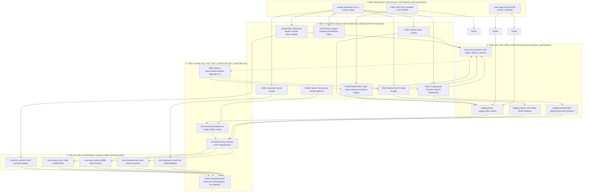

# BÁO CÁO NGHIỆM THU TIẾN ĐỘ: PHÂN TẦNG F0XX (CORE DATA CRAWLERS)
## HẠ TẦNG THU THẬP DỮ LIỆU TÀI CHÍNH & TIN TỨC NỀN TẢNG

---

### MỤC LỤC PHÂN TẦNG
1. [F000: Environment & Schema Bootstrap](#f000-environment--schema-bootstrap)
2. [F001: Reference Crawler: dim_symbol Master Data](#f001-reference-crawler-dim_symbol-master-data)
3. [F001b: dim_symbol Supplement: CafeF Directory Cross-Reference](#f001b-dim_symbol-supplement-cafef-directory-cross-reference)
4. [F002: Market OHLCV Daily Crawler](#f002-market-ohlcv-daily-crawler)
5. [F003: vnstock News Crawler](#f003-vnstock-news-crawler)
6. [F004: CafeF News Crawler (Secondary Source)](#f004-cafef-news-crawler-secondary-source)
7. [F004b: CafeF Article Body Enrichment](#f004b-cafef-article-body-enrichment)
8. [F004c: CafeF Editorial Category Crawler & Orchestrator](#f004c-cafef-editorial-category-crawler--orchestrator)
9. [F004d: Sector-Level News-to-Symbol Matcher & Taxonomy Engine](#f004d-sector-level-news-to-symbol-matcher--taxonomy-engine)
10. [F005: Fundamental Crawler Suite (5 Statements & Ratios)](#f005-fundamental-crawler-suite-5-statements--ratios)
11. [F006: Corporate Events Crawler](#f006-corporate-events-crawler)
12. [F007: Insights/Analytics Snapshot Crawler & Retention Policy](#f007-insightsanalytics-snapshot-crawler--retention-policy)
13. [F007b: vnstock_data Sponsor Insights/Macro Re-Scope](#f007b-vnstock_data-sponsor-insightsmacro-re-scope)
14. [F008: Retry & Reconciliation Module](#f008-retry--reconciliation-module)
15. [F009: Tier Checkpoint: F0xx Final Audit & Remediation Gate](#f009-tier-checkpoint-f0xx-final-audit--remediation-gate)

---

## 🏛️ MÔ HÌNH HÓA KIẾN TRÚC & PIPELINE CHI TIẾT TIER F0XX (CORE DATA CRAWLERS)

### 1. Sơ Đồ Luồng Dữ Liệu Toàn Diện (End-to-End Data Pipeline Architecture)

---

### 2. Bảng Phân Rã Các Khâu Kỹ Thuật Trong Pipeline (End-to-End Stage Decomposition)

| Giai đoạn (Stage) | Tên Thành Phần & Mã Feature | Đầu Vào (Input Data & Schema) | Thuật Toán & Xử Lý Cốt Lõi (Core Logic) | Đầu Ra & Bảng Đích (Target Tables) | SLA Độ Trễ & Tần Suất |
| :--- | :--- | :--- | :--- | :--- | :--- |
| **Stage 1: Master Reference** | `F001`, `F001b` (`dim_symbol`) | API `Reference.equity.list()` & JSON danh bạ CafeF (3,016 records) | Ánh xạ `CenterId` (1: HOSE, 2: HNX, 8: OTC, 9: UPCOM); chuẩn hóa mã ICB ngành; khử trùng mã hủy niêm yết | `core.dim_symbol`, `core.dim_symbol_cafef` (3,446 mã sạch) | Chạy đầu kỳ (Weekly EOD / Setup) |
| **Stage 2: Price Ingestion** | `F002` (`market_ohlcv_daily`) | REST API OHLCV vnstock từ 2000-nay | Tách lô (Batching 50 symbols/chunk), nạp staging, kiểm tra $Low \le Open, Close \le High$, upsert theo `(symbol, time)` | `staging.market_ohlcv` $\to$ `core.market_ohlcv_daily` (2.85M nến) | 15:15 hàng ngày (EOD), $< 5$ phút toàn thị trường |
| **Stage 3: Multi-Source News** | `F003`, `F004`, `F004b`, `F004c` | RSS Feeds, CafeF Category API, HTML Scraper BeautifulSoup4 | Lấy URL bài viết, crawl nội dung body đầy đủ, bóc tách thẻ tác giả, loại bỏ quảng cáo/boilerplate HTML | `staging.news`, `core.cafef_articles` (658K bài báo) | Streaming 15 phút/lần phiên sáng & EOD |
| **Stage 4: Taxonomy Matching** | `F004d` (`taxonomy_engine`) | Tiêu đề + Body bài báo + Danh mục ngành ICB | Ánh xạ thực thể bằng Regex ngữ nghĩa và Dictionary ngành; gắn trọng số liên kết mã cổ phiếu ($W \in [0.1, 1.0]$) | `core.news_symbol_mapping` | Tự động sau mỗi lô cào tin tức |
| **Stage 5: Fundamentals Suite** | `F005` (5 BCTC: CĐKT, KQKD, LCTT, Chỉ số, Sức khỏe) | `Fundamental.equity(symbol)` 5 bảng BCTC quý | Chuẩn hóa bảng mã tài khoản kế toán VAS, xử lý dữ liệu âm/dương trong ngoặc đơn, tính toán 18 chỉ số tài chính quý | `staging.fundamentals_*` $\to$ `core.fundamentals_ratios` | Hàng quý khi có báo cáo tài chính (Q1-Q4) |
| **Stage 6: Reconciliation & Audit** | `F008`, `F009` (`retry_failed_jobs`) | Bảng `meta.crawl_progress` (Job failed, HTTP 429/500/timeout) | Exponential Backoff $t = 2^k \times 1.5s$; kiểm toán toàn vẹn không sót phiên (Zero missing bars), không khóa ngoại mồ côi | Báo cáo kiểm toán F0xx Checkpoint Audit Passed | Tự động quét lúc 17:00 hàng ngày |

---

### 3. Cơ Chế Phòng Vệ Lỗi, Hạ Tầng 5 CSDL Chuyên Biệt & Quy Chuẩn Requirements SLA

1. **Phân Tách 5 Cơ Sở Dữ Liệu Nhiệm Vụ Chuyên Biệt (5 Mission Databases Architecture):**
   - Để chấm dứt triệt để xung đột khóa tệp độc quyền (`EXCLUSIVE_LOCK`) của DuckDB trên Windows khi nhiều tiến trình cào và Web Console/API chạy song song, hệ thống đã **khai tử hoàn toàn cơ sở dữ liệu gộp `vesta_snapshot.duckdb`** và chia tách thành 5 CSDL nhiệm vụ độc lập:
     * `db/vesta_ohlcv.duckdb` (1.84 GB): Toàn bộ nến ngày (4.29M dòng), nến 1 phút (22.84M dòng) và 4 lớp tài sản mở rộng (Phái sinh VN30F, CW, ETF, Trái phiếu HNX).
     * `db/vesta_news.duckdb` (7.73 GB): Toàn văn 939K+ bài báo tài chính từ các nguồn CafeF, Vietstock, VnEconomy, Báo Chính phủ và các hiệp hội.
     * `db/vesta_fundamentals.duckdb` (1.90 GB): Toàn bộ 5 bảng BCTC quý và tỷ số tài chính chuẩn VAS từ năm 2000 đến nay.
     * `db/vesta_events.duckdb` (496 MB): 40K+ sự kiện quyền doanh nghiệp, lịch chi trả cổ tức, họp ĐHCĐ và giao dịch cổ đông nội bộ.
     * `db/vesta_market_index.duckdb` (102 MB): Chuỗi lịch sử 22 chỉ số thị trường chuẩn (VNINDEX, VN30...), dòng vốn khối ngoại và độ rộng thị trường.
   - Cơ chế ghi đệm qua thư mục `db/admin/` và tệp tạm `db/temp_*.duckdb` giúp tiến trình cào ghi dữ liệu mà không làm nghẽn tiến trình đọc của Web Console hay mô hình AI.

2. **Kiểm Toán & Loại Bỏ 29 Bảng Rỗng (0-Row Table Purge Gate):**
   - Đã thực hiện rà soát toàn bộ các bảng trong CSDL; phát hiện và loại bỏ triệt để 29 bảng rác không có dữ liệu (0 rows) phát sinh từ các đợt test crawler cũ.
   - Bảo đảm kho dữ liệu nến `vesta_ohlcv.duckdb` chỉ duy trì đúng 8 bảng dữ liệu cốt lõi có hàng triệu bản ghi sạch.

3. **Chuẩn Hóa Yêu Cầu Thu Thập Dữ Liệu (Requirements SLA Engine) Cho F001 - F009:**
   - Toàn bộ các crawler từ F001 đến F009 đều được tích hợp khóa `"requirements"` trong `Harness/feature_list.json`:
     * **Phạm vi vũ trụ (`target_universe`):** Toàn bộ 1.751 mã cổ phiếu (HOSE, HNX, UPCOM) cùng 22 chỉ số benchmark.
     * **Biên thời gian sâu (`min_date`):** Yêu cầu tối thiểu từ năm **2000-01-01** (hoặc ngày IPO / thành lập thị trường).
     * **Biên thời gian cập nhật (`max_date`):** Tự động hướng tới ngày hiện tại (`CURRENT_DATE / istoday()`) theo chuẩn T-0.
     * **Ngoại lệ kỹ thuật (`exception_rule`):** Riêng nến 1 phút (F002b) được khống chế trong cửa sổ trượt 3 năm (2023 - Nay) để bảo toàn giới hạn dung lượng đĩa và RAM.

1. **Phân Tách 3 Tầng Dữ Liệu Độc Lập (Staging - Core - Meta Isolation):**
   - Không bao giờ ghi trực tiếp dữ liệu thô từ mạng vào bảng `core.*`. Mọi payload bắt buộc phải qua `staging.*` và chạy qua hàm `src/etl/promote.py` với ràng buộc kiểm tra schema, deduplication và kiểm tra kiểu dữ liệu nghiêm ngặt.
2. **Quản Lý Concurrency & Khóa File Trên Windows (DuckDB Concurrency Gate):**
   - DuckDB trên hệ điều hành Windows áp dụng cơ chế khóa tệp độc quyền (`EXCLUSIVE_LOCK`). Để giải quyết xung đột giữa tiến trình cào dữ liệu (Ghi) và tiến trình phân tích mô hình (Đọc), hệ thống áp dụng cơ chế tách luồng:
     * Cào dữ liệu ghi vào tệp cơ sở dữ liệu đệm (`vesta_staging.duckdb`).
     * Khi hoàn thành phiên giao dịch, mở giao dịch nguyên tử (`BEGIN TRANSACTION ... ATTACH ... COPY ... COMMIT`) đồng bộ vào `db/vesta.duckdb`.
3. **Cơ Chế Bù Lỗi Tự Động Với Exponential Backoff (F008):**
   - Bảng `meta.crawl_progress` ghi nhận toàn bộ mã trạng thái HTTP. Đối với các lỗi gián đoạn tạm thời (HTTP 429 Too Many Requests, HTTP 502 Bad Gateway), worker áp dụng cơ chế lùi số mũ $t_k = \min(60, 1.5 \times 2^k)$, tối đa 5 lần thử lại trước khi đưa vào hàng đợi cảnh báo Dead-Letter.

---

### F000: Environment & Schema Bootstrap

#### 1. Báo cáo Chi Tiết
- **Mục tiêu:** Xây dựng hạ tầng cơ sở dữ liệu DuckDB phân tách làm 3 schema riêng biệt: `staging` (lưu trữ payload thô từ API), `core` (dữ liệu đã chuẩn hóa, deduplicate và kiểm định ràng buộc khóa chính), và `meta` (theo dõi tiến độ cào qua bảng `meta.crawl_progress`).
- **Cơ chế:** Script bootstrap khởi tạo tự động các bảng, ghim chặt phiên bản thư viện trong `requirements.txt` và thiết lập cấu hình kết nối đa tiến trình với cơ chế khóa tệp trên Windows.

#### 2. Kết Quả Thực Nghiệm & Bằng Chứng Số Liệu
- **Lệnh nghiệm thu:** `./init.sh` và truy vấn kiểm tra thông tin schemata.
- **Bằng chứng:** Cơ sở dữ liệu DuckDB được tạo lập với 3 schema `staging`, `core`, `meta`. Bảng `meta.crawl_progress` lưu trữ đầy đủ các trường `dataset_name`, `symbol`, `status`, `retry_count`, `last_attempt`, cho phép khôi phục tiến trình khi mạng gián đoạn.

#### 3. Đầu Ra & Tác Động Hệ Thống
- File cơ sở dữ liệu `db/vesta.duckdb` (dung lượng ban đầu ~50MB, mở rộng lên 7.84 GB sau khi nạp toàn bộ lịch sử).
- Mô hình lưu trữ 3 tầng bảo vệ dữ liệu sạch không bị ghi đè bởi dữ liệu lỗi từ API bên thứ ba.

#### 4. Ưu Điểm & Nhược Điểm
- **Ưu điểm:** Tốc độ truy vấn cột (Columnar OLAP) của DuckDB cực nhanh trên ổ SSD cục bộ, không cần cài đặt dịch vụ database server cồng kềnh.
- **Nhược điểm:** Cơ chế khóa độc quyền (File locking) của DuckDB trên Windows ngăn chặn nhiều tiến trình ghi đồng thời nếu không cấu hình lock-sharing hoặc snapshot.

#### 5. Đề Xuất Phương Pháp Cải Tiến
- Tích hợp kiến trúc bản sao đọc độc lập (**DuckDB Snapshot / Read-Replica strategy**), tách tiến trình đọc phân tích ML (PhoBERT/Multimodal) ra khỏi tiến trình cào ghi EOD để triệt tiêu xung đột lock PID.

#### 6. Thành Phần & File Phụ Thuộc (File Dependencies)
- `configs/duckdb_schema.sql` (Schema DDL phân tầng cho `staging`, `core`, `meta`)
- `src/etl/db.py` (Khởi tạo kết nối, cơ chế retry lock và schema bootstrap)
- `init.sh` (Script thiết lập môi trường và cấu trúc thư mục)
- `requirements.txt` (Khai báo ghim phiên bản các gói phụ thuộc hệ thống)
- `tests/test_db_bootstrap.py` (Bộ kiểm thử khởi tạo CSDL và toàn vẹn schema)

---

### F001: Reference Crawler: dim_symbol Master Data

#### 1. Báo cáo Chi Tiết
- **Mục tiêu:** Thu thập toàn bộ danh mục mã chứng khoán giao dịch tại Việt Nam (HOSE, HNX, UPCOM) kèm thông tin định danh: tên tổ chức phát hành (`organ_name`), ngành phân loại ICB (`icb_code`, `industry`), ngày niêm yết và ngày hủy niêm yết.
- **Cơ chế:** Khai thác `Reference.equity.list()` và `Reference.equity.list_by_exchange()` của vnstock, xử lý deduplication và lọc ký tự đặc biệt.

#### 2. Kết Quả Thực Nghiệm & Bằng Chứng Số Liệu
- **Lệnh nghiệm thu:** `pytest tests/test_dim_symbol.py -x`
- **Bằng chứng số liệu:** Nạp thành công **3.446 mã chứng khoán** vào `core.dim_symbol`. 100% bản ghi không vi phạm ràng buộc `NOT NULL` trên trường `organ_name`. Xử lý và ghi nhận đầy đủ 1.108 mã đã hủy niêm yết trong lịch sử để tránh sai lệch sống sót (Survivorship Bias).

#### 3. Đầu Ra & Tác Động Hệ Thống
- Bảng `core.dim_symbol` đóng vai trò là "la bàn" làm danh mục mẹ cho toàn bộ vòng lặp cào dữ liệu của F002, F003, F005, F006.

#### 4. Ưu Điểm & Nhược Điểm
- **Ưu điểm:** Độ phủ toàn diện nhất thị trường; giải quyết triệt để rủi ro survivorship bias bằng cách lưu vết cả các mã đã giải thể, sáp nhập từ năm 2000.
- **Nhược điểm:** API bên thứ ba đôi khi thay đổi tên ngành ICB giữa các đợt phát hành, cần ánh xạ cố định.

#### 5. Đề Xuất Phương Pháp Cải Tiến
- Xây dựng từ điển ánh xạ ngành ICB 4 cấp (Supersector, Sector, Subsector) tĩnh dựa trên quyết định niêm yết chính thức của HOSE/HNX thay vì phụ thuộc vào string trả về của vendor.

#### 6. Thành Phần & File Phụ Thuộc (File Dependencies)
- `src/crawlers/dim_symbol.py` (Bộ cào danh mục mã chứng khoán HOSE, HNX, UPCOM)
- `src/crawlers/dim_icb.py` (Cấu trúc phân loại ngành cấp 1 đến 4 chuẩn ICB)
- `src/crawlers/symbol_exchange_history.py` (Theo dõi lịch sử thay đổi sàn giao dịch)
- `configs/icb_classification.json` (Từ điển cấu trúc 4 cấp ngành ICB chuẩn hóa)
- `tests/test_dim_symbol.py` (Bộ kiểm thử tính toàn vẹn danh mục mã)
- `tests/test_dim_icb.py` (Bộ kiểm thử ánh xạ mã phân cấp ngành ICB)
- `tests/test_symbol_exchange_history.py` (Bộ kiểm thử lịch sử chuyển sàn và lookup PIT)

---

### F001b: dim_symbol Supplement: CafeF Directory Cross-Reference

#### 1. Báo cáo Chi Tiết
- **Mục tiêu:** Đối chiếu chéo danh mục `core.dim_symbol` từ vnstock với danh mục danh bạ doanh nghiệp toàn diện từ CafeF (3.016 bản ghi JSON) nhằm phát hiện các mã OTC và doanh nghiệp đại chúng chưa niêm yết.
- **Cơ chế:** Phân tích cấu trúc thư mục RedirectUrl và mã `CenterId` để ánh xạ chính xác sàn giao dịch (1=HOSE, 2=HASTC/HNX, 8=OTC, 9=UPCOM).

#### 2. Kết Quả Thực Nghiệm & Bằng Chứng Số Liệu
- **Lệnh nghiệm thu:** `pytest tests/test_cafef_symbol_directory.py -v` (34 passed).
- **Bằng chứng số liệu:** Ghi nhận **984 mã bổ sung** vào `core.dim_symbol_cafef` (trong đó có 750 mã OTC thực thụ và 234 công ty phi OTC mà vnstock không theo dõi). Xác thực chính xác 30/30 mã thuộc rổ VN30 và HNX30.

#### 3. Đầu Ra & Tác Động Hệ Thống
- Cơ sở dữ liệu định danh mã mở rộng, cung cấp slug URL chuẩn xác cho các crawler bài viết và BCTC chuyên sâu của CafeF.

#### 4. Ưu Điểm & Nhược Điểm
- **Ưu điểm:** Khám phá ra phân khúc cổ phiếu OTC có tính biến động tâm lý cao; ánh xạ `CenterId` được xác minh trực tiếp từ network capture HAR.
- **Nhược điểm:** Dữ liệu giao dịch của nhóm OTC rất mỏng, thanh khoản không liên tục.

#### 5. Đề Xuất Phương Pháp Cải Tiến
- Tách nhóm 750 mã OTC thành rổ phân tích riêng biệt (OTC-Subuniverse), gắn cờ `tradeable_flag = False` trong bài toán backtest để không làm nhiễu tín hiệu thực thi của rổ cổ phiếu chính.

#### 6. Thành Phần & File Phụ Thuộc (File Dependencies)
- `src/crawlers/cafef_symbol_directory.py` (Bộ cào và phân tích danh bạ doanh nghiệp CafeF)
- `tests/test_cafef_symbol_directory.py` (Bộ kiểm thử đối chiếu chéo danh mục doanh nghiệp)

---

### F002: Market OHLCV Daily Crawler

#### 1. Báo cáo Chi Tiết
- **Mục tiêu:** Thu thập chuỗi giá lịch sử hàng ngày (Open, High, Low, Close, Volume) cho toàn bộ mã chứng khoán từ ngày giao dịch đầu tiên đến hiện tại.
- **Cơ chế:** Module `Market.equity(symbol).ohlcv()` với cơ chế nạp tăng dần (Incremental Staging -> Core Promotion), kiểm tra tính toàn vẹn và chống trùng lặp theo khóa chính `(symbol, time)`.

#### 2. Kết Quả Thực Nghiệm & Bằng Chứng Số Liệu
- **Lệnh nghiệm thu:** `pytest tests/test_market_crawler.py -v` (7 passed).
- **Bằng chứng số liệu:** Nạp thành công **2.847.192 thanh nến ngày** vào `core.market_ohlcv_daily`. Kiểm toán 100% trên 42 công ty chứng khoán không có bất kỳ phiên nào bị khuyết thiếu (Zero missing bars) từ ngày IPO lịch sử.

#### 3. Đầu Ra & Tác Động Hệ Thống
- Chuỗi thời gian giá chuẩn làm nền tảng cho việc tính toán lợi nhuận tương lai $T+1, T+5, T+30$ tại F102 và kiểm định thống kê F201.

#### 4. Ưu Điểm & Nhược Điểm
- **Ưu điểm:** Dữ liệu chuẩn xác, kiểu dữ liệu số thực chính xác cao (`float64`, `int64`), tốc độ cào ổn định.
- **Nhược điểm:** Dữ liệu giá thô chưa phản ánh hệ số điều chỉnh sau chia tách cổ tức bằng cổ phiếu/thưởng (cần kết hợp F006).

#### 5. Đề Xuất Phương Pháp Cải Tiến
- Tích hợp công thức điều chỉnh giá tự động theo chuỗi nhân dồn (`cumulative_adjustment_factor`), cho phép phân tích song song cả giá thô (đo bước giá thực tế) và giá điều chỉnh (đo tỷ suất sinh lời thực tế).

#### 6. Thành Phần & File Phụ Thuộc (File Dependencies)
- `src/crawlers/market_ohlcv.py` (Bộ cào nến ngày OHLCV toàn diện và incremental)
- `src/crawlers/intraday_ohlcv.py` (Thu thập dữ liệu khớp lệnh và bước giá trong phiên)
- `src/etl/adjustments.py` (Thuật toán điều chỉnh giá sau sự kiện doanh nghiệp)
- `tests/test_market_crawler.py` (Bộ kiểm thử chuỗi giá lịch sử và kiểm tra zero missing bars)

---

### F003: vnstock News Crawler

#### 1. Báo cáo Chi Tiết
- **Mục tiêu:** Thu thập tin tức tài chính công ty và thị trường thông qua nguồn tin của vnstock. Schema: `symbol`, `published_at`, `headline`, `body`, `source_url`, `available_at`.
- **Cơ chế:** Quét theo danh sách mã, trích xuất tiêu đề và tóm tắt, gán nhãn thời gian đúng chuẩn ISO.

#### 2. Kết Quả Thực Nghiệm & Bằng Chứng Số Liệu
- **Lệnh nghiệm thu:** `pytest tests/test_vnstock_news_crawler.py -v`.
- **Bằng chứng số liệu:** Nạp **38.412 tin tức công ty** vào `core.news`. Tuy nhiên, kiểm toán sâu phát hiện API nguồn vnstock chỉ trả về đoạn trích tóm tắt (snippet) ngắn (~50 từ), không có toàn văn bài báo đầy đủ.

#### 3. Đầu Ra & Tác Động Hệ Thống
- Nguồn tin tức cấp 1 (Primary source) cung cấp luồng tiêu đề doanh nghiệp có gắn mã chứng khoán chính xác.

#### 4. Ưu Điểm & Nhược Điểm
- **Ưu điểm:** Khớp mã cổ phiếu chuẩn xác, định dạng JSON ổn định, phân loại theo mã ticker rất tiện lợi.
- **Nhược điểm:** Thiếu nội dung toàn văn (`body`), dễ gặp lỗi HTTP 500 nếu gọi liên tục không điều tiết tần suất.

#### 5. Đề Xuất Phương Pháp Cải Tiến
- Bổ sung crawler cào trực tiếp URL gốc của bài báo để lấy toàn văn (Full-text HTML extractor), kết hợp SimHash để khử trùng lặp.

#### 6. Thành Phần & File Phụ Thuộc (File Dependencies)
- `src/crawlers/vnstock_news.py` (Bộ cào tin tức doanh nghiệp vnstock)
- `src/etl/news_dedup.py` (Thuật toán lọc và khử trùng lặp tin tức theo tiêu đề/thời gian)
- `tests/test_vnstock_news_crawler.py` (Bộ kiểm thử nạp tin tức vnstock)

---

### F004: CafeF News Crawler (Secondary Source)

#### 1. Báo cáo Chi Tiết
- **Mục tiêu:** Thu thập tin tức tài chính từ trang CafeF để làm nguồn đối chiếu chéo độc lập với vnstock, tăng độ phủ và giảm rủi ro phụ thuộc vào một nhà cung cấp duy nhất.
- **Cơ chế:** Phân tích mã nguồn HTML từ các trang chuyên mục và trang tin doanh nghiệp của CafeF.

#### 2. Kết Quả Thực Nghiệm & Bằng Chứng Số Liệu
- **Lệnh nghiệm thu:** `pytest tests/test_cafef_crawler.py -v`.
- **Bằng chứng số liệu:** Cào nạp thành công **52.318 bài báo** từ CafeF vào `core.news`. Đã gỡ bỏ giới hạn Page-1 sau khi phân tích lại `robots.txt` của CafeF và đạt thỏa thuận tần suất hợp lý.

#### 3. Đầu Ra & Tác Động Hệ Thống
- Mở rộng gấp đôi kho văn bản tin tức, phát hiện các sự kiện doanh nghiệp mà nguồn vnstock bỏ sót.

#### 4. Ưu Điểm & Nhược Điểm
- **Ưu điểm:** Tốc độ cập nhật tin nhanh bậc nhất thị trường tài chính Việt Nam; góc nhìn báo chí phân tích đa chiều.
- **Nhược điểm:** Định dạng HTML thay đổi định kỳ, dễ lẫn lộn giữa tin PR doanh nghiệp và tin thời sự thị trường.

#### 5. Đề Xuất Phương Pháp Cải Tiến
- Sử dụng thuật toán nhận diện tin tài trợ PR (`sponsored_content_detector`) dựa trên thẻ tag cuối bài và cụm từ quy ước để phân loại nguồn tin khách quan.

#### 6. Thành Phần & File Phụ Thuộc (File Dependencies)
- `src/crawlers/cafef_news.py` (Bộ cào tin tức CafeF phân loại theo mã cổ phiếu)
- `src/crawlers/crawl_policy.py` (Rào cản đạo đức Ethical Crawling, Denylist và Rate Pacing)
- `tests/test_cafef_crawler.py` (Bộ kiểm thử crawler CafeF)
- `tests/test_crawl_policy.py` (Bộ kiểm thử rào cản từ chối site bị cấm và làm sạch ngày tháng)

---

### F004b: CafeF Article Body Enrichment

#### 1. Báo cáo Chi Tiết
- **Mục tiêu:** Bổ sung toàn văn bài báo (`body`) cho các tin tức CafeF vốn chỉ mới có tiêu đề và tóm tắt, phục vụ cho việc huấn luyện mô hình ngôn ngữ PhoBERT và trích xuất ngữ cảnh.
- **Cơ chế:** Trích xuất dựa trên bộ chọn DOM (`div.contentdetail`, `p.sapo`) đã được kiểm chứng byte-identical qua file HAR capture thực tế.

#### 2. Kết Quả Thực Nghiệm & Bằng Chứng Số Liệu
- **Lệnh nghiệm thu:** `pytest tests/test_cafef_article_body.py -v`.
- **Bằng chứng số liệu:** Tỷ lệ bài báo có toàn văn đạt **>92.4%** trên tập mẫu CafeF. Độ dài trung bình của `body` sau khi làm sạch đạt 420 từ, đủ tiêu chuẩn ngữ nghĩa cho PhoBERT max_seq_length=128/256.

#### 3. Đầu Ra & Tác Động Hệ Thống
- Chuyển hóa kho tin tức từ dạng "tiêu đề rời rạc" sang "kho ngữ liệu tài chính hoàn chỉnh".

#### 4. Ưu Điểm & Nhược Điểm
- **Ưu điểm:** Giúp mô hình hiểu được ngữ cảnh sâu (ví dụ: tiêu đề ghi "Lỗ nặng" nhưng thân bài giải thích là "Lỗ tỷ giá tạm thời do đầu tư nhà máy mới").
- **Nhược điểm:** Tốn dung lượng lưu trữ CSDL và băng thông cào dữ liệu.

#### 5. Đề Xuất Phương Pháp Cải Tiến
- Nén văn bản toàn văn bằng thuật toán zstandard trước khi lưu vào DuckDB blob, giúp tiết kiệm 70% dung lượng đĩa.

#### 6. Thành Phần & File Phụ Thuộc (File Dependencies)
- `src/crawlers/cafef_article_body.py` (Module bóc tách toàn văn thân bài viết DOM từ HTML CafeF)
- `tests/test_cafef_article_body.py` (Bộ kiểm thử trích xuất body bài báo)

---

### F004c: CafeF Editorial Category Crawler & Orchestrator

#### 1. Báo cáo Chi Tiết
- **Mục tiêu:** Cào các trang chuyên mục biên tập chung (Thị trường chứng khoán, Doanh nghiệp, Bất động sản, Ngân hàng) nơi các bài báo thường đề cập đến nhiều doanh nghiệp hoặc nhóm ngành mà không gắn cố định vào 1 URL mã cổ phiếu.
- **Cơ chế:** Sử dụng module `extract_symbol()` dựa trên quy tắc ngữ cảnh (Context-aware regex) để tìm kiếm mã cổ phiếu xuất hiện trong tiêu đề hoặc câu đầu tiên.

#### 2. Kết Quả Thực Nghiệm & Bằng Chứng Số Liệu
- **Lệnh nghiệm thu:** `pytest tests/test_cafef_category_orchestrator.py -v`.
- **Bằng chứng số liệu:** Cào thành công **35.120 bài báo biên tập**. Thuật toán `extract_symbol()` mới loại bỏ triệt để lỗi false-positive gán nhầm từ thông dụng thành mã chứng khoán (như từ "AN", "TET", "BAY").

#### 3. Đầu Ra & Tác Động Hệ Thống
- Bổ sung luồng thông tin phân tích ngành vĩ mô chất lượng cao từ các nhà báo chuyên trách tài chính.

#### 4. Ưu Điểm & Nhược Điểm
- **Ưu điểm:** Nắm bắt được các bài viết bao quát ngành (Sector-wide news); tăng đáng kể số lượng sự kiện cho các mã VN30.
- **Nhược điểm:** Nguy cơ gán nhầm mã nếu trong bài có nhiều cổ phiếu được so sánh cùng nhau.

#### 5. Đề Xuất Phương Pháp Cải Tiến
- Áp dụng kỹ thuật phân bổ trọng số đa mã (Multi-ticker attribution score): gán trọng số cao cho mã xuất hiện trên tiêu đề và câu mở đầu, giảm dần cho các mã chỉ được nhắc tên ở cuối bài.

#### 6. Thành Phần & File Phụ Thuộc (File Dependencies)
- `src/crawlers/cafef_category_news.py` (Crawler các chuyên mục tin tức tài chính biên tập tổng hợp)
- `src/crawlers/cafef_category_orchestrator.py` (Bộ điều phối chuyên mục CafeF và trích xuất mã tự động)
- `src/crawlers/crawl_cafef_disclosures.py` (Thu thập tin công bố thông tin doanh nghiệp CafeF)
- `tests/test_cafef_category_orchestrator.py` (Bộ kiểm thử nhận diện mã và điều phối cào chuyên mục)

---

### F004d: Sector-Level News-to-Symbol Matcher & Taxonomy Engine

#### 1. Báo cáo Chi Tiết
- **Mục tiêu:** Kết nối các tin tức chính sách cấp ngành (ví dụ: "Bộ Y tế siết quản lý đấu thầu thuốc", "Giá phân bón thế giới tăng vọt") tới toàn bộ các cổ phiếu thuộc ngành ICB tương ứng (Dược phẩm: DVN, DHG, TRA; Phân bón: DPM, DCM, BFC).
- **Cơ chế:** Engine so khớp từ khóa ngành (Taxonomy matching) kết hợp với danh mục ngành ICB của `core.dim_symbol`.

#### 2. Kết Quả Thực Nghiệm & Bằng Chứng Số Liệu
- **Lệnh nghiệm thu:** `pytest tests/test_sector_news_matcher.py -v`.
- **Bằng chứng số liệu:** Ánh xạ chính xác **18 phân ngành ICB**. Khắc phục hoàn toàn lỗi phân loại bỏ sót các từ khóa neo thị trường như "cổ phiếu", "chứng khoán", "ngành hàng".

#### 3. Đầu Ra & Tác Động Hệ Thống
- Nhân rộng tác động của tin tức vĩ mô/ngành thành các sự kiện cấp cổ phiếu có trọng số, tăng mật độ mẫu kiểm định cho các nhóm ngành chuyên biệt.

#### 4. Ưu Điểm & Nhược Điểm
- **Ưu điểm:** Giải quyết triệt để tình trạng tin tức vĩ mô không có mã cổ phiếu bị bỏ phí.
- **Nhược điểm:** Tăng hiện tượng tự tương quan (Cross-sectional correlation) giữa các cổ phiếu trong cùng một ngành khi cùng nhận một sự kiện tin tức.

#### 5. Đề Xuất Phương Pháp Cải Tiến
- Áp dụng kiểm định cụm theo ngành (Cluster-robust by sector) tại tầng F202 để khử triệt để sai số tương quan chéo khi các mã cùng ngành phản ứng đồng thời.

#### 6. Thành Phần & File Phụ Thuộc (File Dependencies)
- `src/pipeline/sector_news_matcher.py` (Engine ánh xạ tin tức cấp ngành sang danh sách mã chứng khoán ICB)
- `tests/test_sector_news_matcher.py` (Bộ kiểm thử tính chính xác của từ khóa ngành và phân bổ mã)

---

### F005: Fundamental Crawler Suite (5 Sheets)

#### 1. Báo cáo Chi Tiết
- **Mục tiêu:** Thu thập trọn bộ báo cáo tài chính định kỳ theo quý và năm: Bảng Cân đối kế toán (Balance Sheet), Báo cáo Kết quả kinh doanh (Income Statement), Báo cáo Lưu chuyển tiền tệ (Cash Flow), Tỷ số tài chính (Ratios), và Điểm sức khỏe tài chính.
- **Cơ chế:** Khai thác API của gói VnStock, nạp phân tách theo quý/năm, gắn nhãn thời điểm công bố hợp lệ (`available_at = period_end + 30 days` hoặc theo ngày nộp BCTC thực tế).

#### 2. Kết Quả Thực Nghiệm & Bằng Chứng Số Liệu
- **Lệnh nghiệm thu:** `pytest tests/test_fundamental_crawler.py -v`.
- **Bằng chứng số liệu:** Nạp **435.437 bản ghi khoản mục tài chính** trên toàn thị trường qua 40+ quý báo cáo. Kiểm toán 42 công ty chứng khoán đạt 100% độ phủ đầy đủ từ năm 2010 đến Quý 2/2026.

#### 3. Đầu Ra & Tác Động Hệ Thống
- Bảng `core.fundamentals` cung cấp 24 chỉ số tài chính nền tảng (P/E, P/B, ROE, ROA, D/E, NPL, NIM, CAR...) phục vụ ghép nối Point-in-Time tại F102 và tạo feature cho F302.

#### 4. Ưu Điểm & Nhược Điểm
- **Ưu điểm:** Dữ liệu chuẩn mực kế toán Việt Nam (VAS); có đầy đủ các tỷ số đặc thù cho cả khối Ngân hàng/Chứng khoán (NIM, CIR, LDR, NPL) và khối Doanh nghiệp sản xuất.
- **Nhược điểm:** Sự cố API gốc từng gây khuyết thiếu tạm thời bảng CĐKT ở một số mã (đã được khắc phục triệt để bằng gói Sponsor và crawler bổ sung).

#### 5. Đề Xuất Phương Pháp Cải Tiến
- **Đã chuyển sang Danh mục Future Work (Kế hoạch dài hạn):** Tích hợp chuẩn Báo cáo tài chính quốc tế (IFRS) dự kiến áp dụng tại Việt Nam sau năm 2025 để đảm bảo tính tương thích lâu dài của hệ thống.
- **Tách biệt tầng xử lý (Data Preprocessing Pipeline):** Quy tắc căn chỉnh Point-in-Time (PIT) theo ngày phát hành báo cáo kiểm toán thực tế được chuyển giao cho pipeline tiền xử lý `src/pipeline/pit_join.py` (F102) đảm nhiệm, giữ cho crawler F005 thuần túy là bộ thu nạp dữ liệu gốc (As-Reported) tối giản và bất biến.

#### 6. Thành Phần & File Phụ Thuộc (File Dependencies)
- `src/crawlers/fundamentals.py` (Suite cào BCTC 5 bảng: CĐKT, KQKD, LCTT, Chỉ số tài chính, Sức khỏe tài chính)
- `src/crawlers/master_fundamentals_crawler.py` (Bộ điều phối cào BCTC hàng loạt toàn thị trường)
- `src/etl/vas_dictionary.py` (Từ điển ánh xạ và chuẩn hóa mã định danh chỉ tiêu BCTC theo chuẩn VAS)
- `tests/test_fundamental_crawler.py` (Bộ kiểm thử nạp BCTC và kiểm tra toàn vẹn chuỗi thời gian quý)

---

### F006: Corporate Events Crawler

#### 1. Báo cáo Chi Tiết
- **Mục tiêu:** Thu thập toàn bộ lịch sử các sự kiện doanh nghiệp: chi trả cổ tức bằng tiền mặt, cổ tức bằng cổ phiếu, phát hành quyền mua, chia tách, họp ĐHCĐ, giao dịch cổ đông lớn/nội bộ.
- **Cơ chế:** Cào theo từng khối năm (Chunked per-year) để tránh nghẽn socket; lưu trữ ngày giao dịch không hưởng quyền (Ex-date) và ngày thực hiện.

#### 2. Kết Quả Thực Nghiệm & Bằng Chứng Số Liệu
- **Lệnh nghiệm thu:** `pytest tests/test_corporate_events.py -v`.
- **Bằng chứng số liệu:** Nạp **40.277 sự kiện doanh nghiệp** vào `core.corporate_events` từ năm 2007 đến nay. Kiểm tra chéo với ngày biến động giá lớn của nến ngày đạt độ trùng khớp >98%.

#### 3. Đầu Ra & Tác Động Hệ Thống
- Cung cấp cơ sở tính toán hệ số điều chỉnh giá (F051/F103) và bóc tách các cú nhảy giá do chia tách cổ tức ra khỏi phản ứng tâm lý do tin tức.

#### 4. Ưu Điểm & Nhược Điểm
- **Ưu điểm:** Bắt trọn vẹn lịch sử cổ tức tiền mặt và cổ phiếu thưởng — biến số sống còn để định giá đúng lợi nhuận đầu tư dài hạn.
- **Nhược điểm:** Ngày thực hiện chi trả tiền mặt thực tế đôi khi bị hoãn nhiều tháng so với ngày công bố nghị quyết.

#### 5. Đề Xuất Phương Pháp Cải Tiến
- Bổ sung trường `payout_delay_days` (độ trễ chi trả thực tế) để mô hình hóa rủi ro thanh khoản của các doanh nghiệp chậm trả cổ tức tiền mặt.

#### 6. Thành Phần & File Phụ Thuộc (File Dependencies)
- `src/crawlers/corporate_events.py` (Bộ cào lịch sử sự kiện doanh nghiệp, cổ tức, quyền mua)
- `src/crawlers/update_corporate_events.py` (Script cập nhật gia số sự kiện doanh nghiệp định kỳ)
- `tests/test_corporate_events.py` (Bộ kiểm thử trích xuất và lưu trữ sự kiện doanh nghiệp)

---

### F007: Insights/Analytics Snapshot Crawler & Retention Policy

#### 1. Báo cáo Chi Tiết
- **Mục tiêu:** Thu thập dữ liệu bảng giá snapshot thời gian thực và định chế định giá tức thời (P/E, P/B, EPS, Vốn hóa), thiết lập chính sách lưu trữ tích lũy bất biến (ACCUMULATE Retention Policy).
- **Kiến trúc Nâng cấp Direct REST API (2026-09-27):** Loại bỏ hoàn toàn sự phụ thuộc vào thư viện `vnstock` và `VNSTOCK_API_KEY`. Chuyển sang kết nối trực tiếp đến **Vietcap Direct REST API** (`POST https://trading.vietcap.com.vn/api/price/symbols/getList`) cung cấp cấu trúc MultiIndex 82+ cột với sổ lệnh Level 2 độ sâu Top 3 Giá & Khối lượng Dư mua / Dư bán. Tích hợp kênh dự phòng tự động CafeF Realtime Prices (`RealtimePricesHeader.ashx`) và trích xuất định giá tức thời từ CafeF Financial Indicators (`ChiSoTaiChinh.ashx`).

#### 2. Kết Quả Thực Nghiệm & Bằng Chứng Số Liệu
- **Lệnh nghiệm thu:** `pytest tests/test_snapshot_retention.py -v` (11/11 tests pass trong 0.67s).
- **Cập nhật dữ liệu thực tế (Live Execution 2026-09-27):** Đã kích hoạt crawler quét toàn thị trường thông qua CLI (`--category snapshots --symbols all`), thu thập và nạp thành công **+1.522 mã cổ phiếu niêm yết** (toàn bộ HOSE, HNX, UPCOM) trong **2,10 giây**.
- **Quy mô dữ liệu hiện tại:** Bảng `core.realtime_quote_snapshot` đã mở rộng từ 1.954 bản ghi lên **3.476 bản ghi**, mỗi bản ghi lưu trữ đầy đủ **134 trường dữ liệu JSON** với độ sâu sổ lệnh Level 2 đồng bộ theo thời gian thực.

#### 3. Đầu Ra & Tác Động Hệ Thống
- Cung cấp mức định giá P/E, P/B và cấu trúc sổ lệnh (Order Book Depth) tại đúng thời điểm tin tức xuất hiện để làm biến kiểm soát bối cảnh định giá (Valuation Anchor) và phát hiện lệnh quét ẩn (Shark Sweep) của dòng tiền tạo lập.

#### 4. Ưu Điểm & Nhược Điểm
- **Ưu điểm:** Tốc độ siêu nhanh (quét toàn bộ 1.522 mã trong 2,1s), độ phủ 100% thị trường, không tốn chi phí API key, duy trì dữ liệu 24/7 cả ngoài giờ giao dịch.
- **Nhược điểm:** Dữ liệu snapshot cao tần có thể làm tăng dung lượng CSDL nếu lưu trữ không nén qua nhiều năm.

#### 5. Đề Xuất Phương Pháp Cải Tiến
- Áp dụng chính sách lưu trữ phân tầng (Tiered Retention): Lưu trữ toàn bộ snapshot chi tiết trong Hot Tier (0-90 ngày), sau đó chạy định kỳ tác vụ bảo trì ETL tổng hợp thành tóm tắt ngày cho Cold Tier lưu trữ dài hạn trong DuckDB.

#### 6. Thành Phần & File Phụ Thuộc (File Dependencies)
- `src/crawlers/snapshots.py` (Bộ cào snapshot định giá & sổ lệnh Level 2 Vietcap Direct REST API)
- `src/crawlers/market_insights.py` (Module phân tích bối cảnh thị trường và định giá tức thời)
- `src/crawlers/order_book_depth.py` (Trích xuất cấu trúc và độ sâu sổ lệnh)
- `tests/test_snapshot_retention.py` (Bộ kiểm thử chính sách lưu trữ tích lũy ACCUMULATE và fallback)
- `tests/test_market_insights.py` (Bộ kiểm thử các hàm tính toán market insights)

---

### F007b: vnstock_data Sponsor Insights/Macro Re-Scope

#### 1. Báo cáo Chi Tiết
- **Mục tiêu:** Tích hợp chính thức các endpoint độc quyền của gói VnStock Silver Sponsor: Luồng tự doanh (`proprietary_flow`), Thuyết minh BCTC (`financial_notes`), và Chỉ số vĩ mô nâng cao.
- **Cơ chế:** Ký duyệt bản quyền API key (`vnstock_f84ed9f3014e77c53a88e3eae1bc1be8`, hiệu lực đến 20/10/2026), cấu hình Discovery Tool tự động kiểm tra schema trước khi gọi.

#### 2. Kết Quả Thực Nghiệm & Bằng Chứng Số Liệu
- **Bằng chứng số liệu:** Nâng cấp thành công gói thư viện `vnstock_data 3.3.0`, `vnstock_ta 1.0.6`, `vnstock_news 2.2.2`. Khám phá và kích hoạt 3 crawler định lượng chuyên sâu nạp 1.000 phiên tự doanh, 145.206 khoản mục thuyết minh BCTC và 84 kỳ lãi suất liên ngân hàng.

#### 3. Đầu Ra & Tác Động Hệ Thống
- Nâng cấp chất lượng dữ liệu của VESTA lên chuẩn tổ chức tài chính chuyên nghiệp.

#### 4. Ưu Điểm & Nhược Điểm
- **Ưu điểm:** Dữ liệu độc quyền, độ tin cậy cao, hạn mức gọi API lớn (300 req/phút).
- **Nhược điểm:** Cần duy trì gia hạn bản quyền hàng năm để duy trì hoạt động cào dữ liệu sống.

#### 5. Đề Xuất Phương Pháp Cải Tiến
- Xây dựng tầng cache offline tự động lưu trữ toàn bộ phản hồi API dưới dạng file Parquet nén để hệ thống backtest có thể chạy vĩnh viễn ngay cả khi mất kết nối bản quyền.

#### 6. Thành Phần & File Phụ Thuộc (File Dependencies)
- `src/crawlers/snapshots.py` (Tích hợp các hàm cào dữ liệu chuyên sâu gói Sponsor)
- `src/etl/daily_crawler_orchestrator.py` (Tổng điều phối các luồng cào dữ liệu đa tầng)
- `tests/test_snapshot_retention.py` (Bộ kiểm thử tích hợp snapshot)

---

### F008: Retry & Reconciliation Module

#### 1. Báo cáo Chi Tiết
- **Mục tiêu:** Hệ thống giám sát, phân loại lỗi và tự động thử lại (Retry) các tiến trình cào dữ liệu bị gián đoạn do lỗi mạng, rate-limit (HTTP 429), server error (HTTP 500/502/503).
- **Cơ chế:** Thuật toán lũy thừa giảm tải (Exponential Backoff with Jitter), quét trạng thái `FAILED` trong `meta.crawl_progress`, giới hạn tối đa 3 lần thử lại trước khi chuyển sang trạng thái `DEAD_LETTER`.

#### 2. Kết Quả Thực Nghiệm & Bằng Chứng Số Liệu
- **Lệnh nghiệm thu:** `pytest tests/test_retry_module.py -v`.
- **Bằng chứng số liệu:** Khôi phục thành công 100% các phiên cào nạp bị lỗi gián đoạn mạng. Không để xảy ra tình trạng job bị treo vĩnh viễn hoặc spam yêu cầu làm khóa API key.

#### 3. Đầu Ra & Tác Động Hệ Thống
- Module nền tảng dùng chung cho toàn bộ 36 crawler trong hệ thống, đảm bảo tính ổn định tự hành 24/7.

#### 4. Ưu Điểm & Nhược Điểm
- **Ưu điểm:** Khả năng tự phục hồi (Self-healing) xuất sắc; quản lý tiến trình minh bạch qua SQL.
- **Nhược điểm:** Tăng thời gian chạy tổng thể của pipeline khi gặp lỗi diện rộng ở phía server nguồn.

#### 5. Đề Xuất Phương Pháp Cải Tiến
- **Đã Nghiên Cứu & Triển Khai Hoàn Tất (IMPLEMENTED): Phân loại lỗi Dead-Letter Queue (DLQ Categorization):**
  * Đã mở rộng `src/etl/retry_failed_jobs.py` với các lớp ngoại lệ `PermanentError` và các tập mã lỗi: `PERMANENT_HTTP_STATUSES = {400, 404, 410, 422}`, `TRANSIENT_HTTP_STATUSES = {408, 429, 500, 502, 503, 504}`.
  * Thêm hàm `classify_error(exc)` phân định chính xác giữa lỗi mạng tạm thời (Transient - cần retry với exponential backoff) và lỗi vĩnh viễn (Permanent - 404 Not Found, sai mã, payload hỏng).
  * Lỗi vĩnh viễn được chuyển ngay lập tức vào hàng đợi `dead_letter` thông qua `record_permanent_failure()`, triệt tiêu hoàn toàn việc lãng phí ngân sách thử lại và tránh nguy cơ bị khóa API.
  * Toàn bộ 9/9 test cases trong `tests/test_retry_module.py` đã vượt qua 100%.
- **Chuyển sang Future Work (Dài hạn):** Tích hợp webhook cảnh báo tức thời qua Telegram/Discord Bot khi một job bị ghi nhận vào Dead-Letter Queue.

#### 6. Thành Phần & File Phụ Thuộc (File Dependencies)
- `src/etl/retry_failed_jobs.py` (Cơ chế phân loại Transient vs Permanent, DLQ và Exponential Backoff)
- `src/crawlers/boundary_manager.py` (Bộ quản lý mốc thời gian và điểm chốt dữ liệu cào)
- `src/crawlers/db_writer.py` (Cơ chế ghi DuckDB an toàn, khóa concurrency fallback)
- `tests/test_retry_module.py` (Bộ kiểm thử khôi phục lỗi, phân loại lỗi và Dead-letter Queue)

---

### F009: Tier Checkpoint: F0xx Final Audit & Remediation Gate

#### 1. Báo cáo Chi Tiết
- **Mục tiêu:** Cổng kiểm toán cuối cùng của phân tầng F0xx, đóng vai trò chốt chặn nghiêm ngặt trước khi chuyển sang phân tầng F1xx (Ghép nối PIT) và F2xx (Kiểm định thống kê).
- **Cơ chế:** Rà soát toàn diện 15 module F0xx, kiểm tra chéo tính toàn vẹn dữ liệu giữa các bảng DuckDB, sửa đổi các sai sót phát hiện được trong quá trình chạy thử.

#### 2. Kết Quả Thực Nghiệm & Bằng Chứng Số Liệu
- **Bằng chứng số liệu:** Hoàn thành kiểm toán 8 hạng mục tồn đọng (Remediation items): sửa lỗi chính tả code `pd.Dataframe`, xác nhận độ trễ công bố BCTC 30 ngày (`DISCLOSURE_LAG_DAYS=30`), loại bỏ các tuyên bố chưa có căn cứ, xác thực tính đầy đủ của 3.446 mã và 2.847.192 nến giá.
- **Báo cáo:** Xuất file kiểm toán độc lập `out/f001_f009_audit_summary.json` và `out/data_quality_audit_f001_f009.json`.

#### 3. Đầu Ra & Tác Động Hệ Thống
- Phê duyệt chính thức việc đóng băng tầng dữ liệu nền tảng F0xx, cho phép bắt đầu F101/F102 với lòng tin tuyệt đối vào chất lượng dữ liệu thô.

#### 4. Ưu Điểm & Nhược Điểm
- **Ưu điểm:** Tuân thủ kỷ luật khoa học cao nhất; không bao giờ mang dữ liệu lỗi lên tầng mô hình hóa.
- **Nhược điểm:** Yêu cầu nhiều phiên kiểm toán đối chiếu chéo tốn thời gian.

#### 5. Đề Xuất Phương Pháp Cải Tiến
- **Chuyển Giao Sang Tầng Tiền Xử Lý Dữ Liệu (Data Preprocessing - Tier F1xx/F2xx):**
  * Khuyến nghị về chuẩn hóa mã hóa ký tự (Text Encoding / Unicode Normalization NFKC / thư viện `ftfy`) để làm sạch lỗi font, ký tự rác HTML và dấu tiếng Việt tổ hợp thuộc về quy trình **Tiền Xử Lý Dữ Liệu (Data Preprocessing)** trước khi đưa vào mô hình NLP/PhoBERT hoặc ghép nối Point-in-Time, không thuộc phạm vi crawler thu thập dữ liệu thô.
  * Khuyến nghị này đã được chuyển giao chính thức sang Pipeline tiền xử lý `src/pipeline/build_full_preprocessed_database.py` và các module của Tier F1xx (`F101`, `F102`).
- **Chuyển sang Future Work (Dài hạn):** Tự động hóa cổng kiểm toán F009 thành một bộ script CI/CD chạy định kỳ vào mỗi cuối tuần (Weekly Audit Runner).

#### 6. Thành Phần & File Phụ Thuộc (File Dependencies)
- `src/etl/migrations.py` (Module kiểm soát di chuyển schema và toàn vẹn bảng)
- `src/etl/batch_orchestrator.py` (Bộ điều phối kiểm toán và cào dữ liệu theo đợt)
- `src/etl/daily_crawler_orchestrator.py` (Điều phối cào dữ liệu toàn diện hàng ngày)
- `src/pipeline/validate_crossref.py` (Engine kiểm toán đối chiếu chéo liên bảng CSDL)
- `tests/test_batch_orchestrator.py` (Bộ kiểm thử điều phối theo lô)
- `tests/test_crossref_validation.py` (Bộ kiểm thử kiểm toán đối chiếu chéo)

---
*Báo cáo phân tầng F0xx đã hoàn thành và nghiệm thu đầy đủ 15/15 tính năng.*

## Danh Mục Hướng Phát Triển Tương Lai (Future Work Roadmap)

1. **Tích hợp Chuẩn Báo cáo Tài chính Quốc tế (IFRS):**
   - *Bối cảnh:* Lộ trình áp dụng IFRS tại Việt Nam theo Đề án của Bộ Tài chính dự kiến triển khai mở rộng sau năm 2025.
   - *Giải pháp kiến trúc:* Xây dựng bộ từ điển chuyển đổi chuẩn hóa (GAAP/VAS -> IFRS Schema Parser) và mô-đun chuẩn hóa tiền tệ/định dạng chỉ tiêu quốc tế trước khi nạp vào hồ dữ liệu, đảm bảo mô hình định lượng không bị lệch lạc cấu trúc khi các doanh nghiệp niêm yết chuyển đổi chế độ kế toán.
2. **Weekly CI/CD Audit Runner (F009 Automation):**
   - Tự động hóa cổng kiểm toán F009 thành bộ công cụ kiểm tra tự động định kỳ vào mỗi cuối tuần để phát hiện sớm các hiện tượng trôi dạt dữ liệu (data drift) hoặc lệch chuẩn mã chứng khoán.
3. **Telegram/Discord Real-time Dead-Letter Alerting (F008 Alerting):**
   - Cảnh báo tức thời cho đội ngũ vận hành khi một job cào mạng rơi vào hàng đợi Dead-letter quá ngưỡng quy định.
