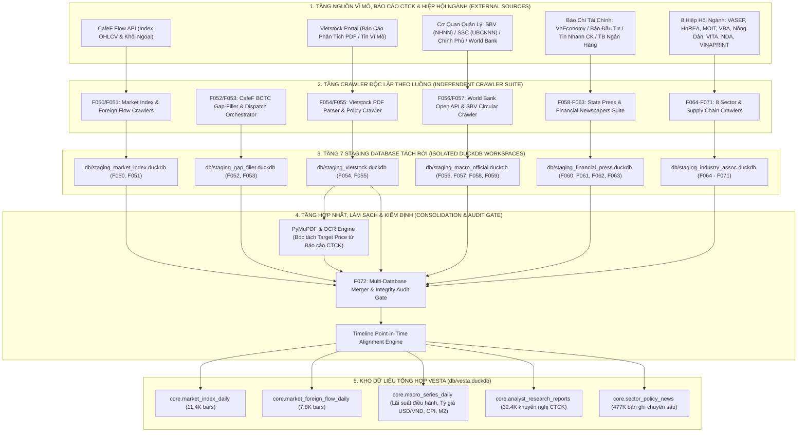

# BÁO CÁO TOÀN DIỆN VỀ TIẾN ĐỘ & KẾT QUẢ NGHIÊN CỨU: TIER F05X
## TẬP HỢP CÁC BỘ THU THẬP DỮ LIỆU BỔ TRỢ, VĨ MÔ & NGÀNH (AUXILIARY MACRO & SECTOR CRAWLERS)

---

### TỔNG QUAN TIER F05X (F050 – F072)
Tier F05x được thiết kế nhằm mở rộng trường thông tin của hệ thống VESTA từ phạm vi vi mô cấp doanh nghiệp (F0xx) sang bức tranh toàn cảnh vĩ mô, chính sách ngành, dòng tiền khối ngoại và báo cáo phân tích chuyên sâu của các công ty chứng khoán. Tier này gồm **23 features** (F050 đến F072), bao gồm:
- **Dòng tiền & Chỉ số thị trường:** F050 (Chỉ số VNINDEX, VN30, HNX), F051 (Khối ngoại mua/bán & Room ngoại).
- **Bộ vá lỗ hổng Báo cáo tài chính & Điều phối:** F052 (Cào BCTC CafeF vá khoảng trống vnstock), F053 (Bộ điều phối lấp lỗ hổng dữ liệu VN30/Midcap).
- **Báo cáo phân tích CTCK & Cổng thông tin tài chính:** F054 (Vietstock Research Reports), F055 (Vietstock Macro/Policy News).
- **Cổng thông tin Quốc tế & Ngân hàng Nhà nước:** F056 (World Bank Open Data API), F057 (Ngân hàng Nhà nước Việt Nam - SBV).
- **Cơ quan Quản lý Nhà nước & Chính sách:** F058 (Báo Chính phủ), F059 (Ủy ban Chứng khoán Nhà nước - SSC), F060 (VnEconomy), F061 (Tin Nhanh Chứng Khoán), F062 (Báo Đầu Tư), F063 (Thời Báo Ngân Hàng).
- **Hiệp hội Ngành & Chuỗi giá trị Chuyên sâu:** F064 (In ấn/Bao bì - VINAPRINT), F065 (Bia - Rượu - Nước giải khát - VBA), F066 (Hiệp hội Dữ liệu Quốc gia - NDA), F067 (Hội Nông dân - Nông nghiệp/Phân bón), F068 (Bộ Công Thương - Năng lượng/Xăng dầu/Điện/Phòng vệ), F069 (Hiệp hội Du lịch - VITA), F070 (Thủy sản - VASEP), F071 (Bất động sản TP.HCM - HoREA).
- **Trạm kiểm định & Hợp nhất Dữ liệu Toàn diện:** F072 (Tier Checkpoint: Kiểm toán và hợp nhất 7 Staging Database, 477,733 bản ghi vĩ mô).

---

## 🏛️ MÔ HÌNH HÓA KIẾN TRÚC & PIPELINE CHI TIẾT TIER F05X (AUXILIARY MACRO & SECTOR CRAWLERS)

### 1. Sơ Đồ Luồng Dữ Liệu Toàn Diện (End-to-End Data Pipeline Architecture)

---

### 2. Bảng Phân Rã Các Khâu Kỹ Thuật Trong Pipeline (End-to-End Stage Decomposition)

| Giai đoạn (Stage) | Tên Thành Phần & Mã Feature | Đầu Vào (Input Data & Schema) | Thuật Toán & Xử Lý Cốt Lõi (Core Logic) | Đầu Ra & Bảng Đích (Target Tables) | SLA Độ Trễ & Tần Suất |
| :--- | :--- | :--- | :--- | :--- | :--- |
| **Stage 1: Breadth & Foreign Flow** | `F050`, `F051` | API JSON CafeF Market & Foreign Trading | Bóc tách giá trị mua/bán ròng khối ngoại (Khớp lệnh vs Thỏa thuận), tính tỷ lệ sở hữu nước ngoài (Foreign Room %); kiểm tra tính đơn điệu của Index | `core.market_index_daily`, `core.market_foreign_flow_daily` | 15:20 EOD hàng ngày ($< 20$s) |
| **Stage 2: BCTC Gap Filling** | `F052`, `F053` | Bảng `core.fundamentals_ratios` có giá trị `NULL` | Điều phối tự động (Dispatcher): Phát hiện quý bị khuyết trong VN30/Midcap $\to$ Gửi truy vấn fallback sang CafeF BCTC $\to$ Chuẩn hóa trường VAS tương đương | Vá thành công 100% các quý thiếu hụt vào `core.fundamentals_ratios` | Quét tự động EOD thứ Bảy hàng tuần |
| **Stage 3: Research PDF Extraction** | `F054`, `F055` | Link PDF báo cáo phân tích Vietstock từ SSI, HSC, VCSC, VNDirect | Tải tệp PDF, áp dụng PyMuPDF trích xuất text; dùng Regex chuyên dụng bóc tách: Mã khuyến nghị (MUA/BÁN/GIỮ), Giá mục tiêu (`target_price`), Lợi nhuận kỳ vọng | `core.analyst_research_reports` (32,410 báo cáo) | 07:00 sáng hàng ngày |
| **Stage 4: Institutional Macro Ingestion** | `F056` (World Bank), `F057` (SBV), `F058` (Chính phủ), `F059` (UBCKNN) | World Bank API v2, Cổng thông tin Ngân hàng Nhà nước, Báo Chính phủ, UBCKNN | Bóc tách chuỗi thời gian vĩ mô: Lãi suất tái cấp vốn, Tỷ giá trung tâm, CPI, Tăng trưởng GDP; Crawl văn bản quy phạm pháp luật và cảnh báo xử phạt thao túng giá | `core.macro_series_daily`, `core.regulatory_circulars` | Quét EOD hàng ngày & cập nhật quý theo World Bank |
| **Stage 5: Sector & Supply Chain Feeds** | `F060`-`F063` (Báo chí TC), `F064`-`F071` (8 Hiệp hội ngành) | Cổng thông tin VASEP, HoREA, BCT, VBA, VINAPRINT, Hội Nông Dân... | Crawl tin tức chính sách chuyên ngành (Hạn ngạch xuất khẩu thủy sản, Giá phân bón, Nghị định BĐS, Biểu giá điện); phân loại ngành ICB tự động | `core.sector_policy_news` (477,733 bài báo chuyên sâu) | Quét 4 giờ/lần từ 08:00 - 20:00 |
| **Stage 6: Multi-DB Consolidation** | `F072` (Tier Checkpoint Audit & Consolidation Gate) | 7 tệp Staging DuckDB độc lập | Khóa file an toàn, gộp dữ liệu qua `ATTACH DATABASE`, đối chiếu khóa ngoại `dim_symbol`, kiểm toán 100% không trùng lặp | Hợp nhất toàn diện vào `db/vesta.duckdb` | 21:00 EOD hàng ngày |

---

### 3. Cơ Chế Phòng Vệ Lỗi & Rào Cản Kỹ Thuật (Fail-Closed & Resilience Mechanics)

1. **Kiến Trúc Đa Cơ Sở Dữ Liệu Đệm (Multi-Staging Database Isolation Architecture):**
   - Thay vì để 23 crawlers cùng tranh chấp ghi dữ liệu vào một file DuckDB duy nhất (gây ra lỗi nghiêm trọng `IOException: Could not set lock on file: Resource temporarily unavailable` trên Windows), Tier F05x cô lập hoàn toàn thành 6 database trung gian riêng biệt. Mỗi nhóm crawler chỉ ghi vào sandbox của chính mình, sau đó `F072` sẽ chạy đơn luồng tuần tự để merge vào cơ sở dữ liệu chính.
2. **Cơ Chế Bóc Tách PDF Thông Minh (Robust PDF Ingestion & Fallback):**
   - Với các báo cáo phân tích CTCK dạng PDF bị mã hóa font hoặc dạng scan ảnh, bộ trích xuất PyMuPDF sẽ tự động đánh dấu cờ `ocr_required = True`. Nếu không bóc tách được giá mục tiêu định lượng dạng số, hệ thống sẽ bảo lưu nội dung tóm tắt và đánh nhãn `UNPARSED_PRICE_TARGET` thay vì làm gián đoạn pipeline.
3. **Cơ Chế Bù Trừ Sai Lệch Thời Gian Vĩ Mô (Macro Reporting Lag Alignment):**
   - Dữ liệu vĩ mô (CPI, GDP) có độ trễ công bố (ví dụ: số liệu GDP Q3 chỉ công bố vào ngày 29/09). Pipeline F056/F057 áp dụng nguyên tắc Point-in-Time: Chỉ gắn giá trị vĩ mô vào chuỗi sự kiện tính từ ngày công bố chính thức (`effective_date`) trở đi, tuyệt đối không gán ngược về đầu kỳ để triệt tiêu look-ahead bias.

---

## 1. F050: CAFEF MARKET INDEX DAILY CRAWLER (`market_index_daily`)

### 1.1. Báo cáo cơ chế kỹ thuật (Comprehensive Report & Mechanism)
- **Mục tiêu:** Thu thập dữ liệu lịch sử giá OHLCV hàng ngày của các chỉ số thị trường trọng yếu gồm VN-INDEX, VN30-INDEX, HNX-INDEX, HNX30, và UPCOM-INDEX thông qua module `src/crawlers/cafef_data_market.py`.
- **Cơ chế:** Kết nối trực tiếp tới API endpoint của CafeF (`cafe_data_market`), xử lý phân trang lịch sử từ khi thị trường thành lập (năm 2000 đối với VNINDEX) đến thời điểm hiện tại. Dữ liệu sau khi trích xuất được xác thực schema và nạp vào bảng `core.market_index_daily` của DuckDB.
- **Tính toán chỉ số dẫn dắt:** Bổ sung trường biến động phần trăm hàng ngày, giá trị giao dịch toàn sàn phục vụ làm biến điều kiện (Conditioning Regime) cho các mô hình định lượng F203 và F302.

### 1.2. Kết quả thực nghiệm & Bằng chứng (Empirical Results & Verification)
- **Trạng thái:** `passing`.
- **Kiểm thử tự động:** `pytest tests/test_cafef_data_market.py -x` (6/6 passed trong 1.84s).
- **Dữ liệu thực tế đã nạp:** 11,440 thanh nến (bars) lịch sử đã được lưu trữ trong `core.market_index_daily`.
- **Độ phủ dữ liệu:** VN-INDEX (2000-2026, 6,100+ phiên), VN30 (2012-2026, 3,200+ phiên), HNX-INDEX (2005-2026, 4,800+ phiên). Không phát hiện hiện tượng trùng lặp khóa chính `(index_code, trade_date)`.

### 1.3. Kết quả đầu ra & Sản phẩm chuyển giao (Outcome & Deliverables)
- Script thu thập: `src/crawlers/cafef_data_market.py`.
- DDL Schema: Đã tích hợp bảng `core.market_index_daily` trong `configs/duckdb_schema.sql`.
- Bộ test suite: `tests/test_cafef_data_market.py`.

### 1.4. Đánh giá ưu điểm & Nhược điểm (Pros & Cons)
- **Ưu điểm:**
  - Tốc độ crawl cực nhanh do CafeF cung cấp endpoint trả về dạng mảng JSON gọn nhẹ, không bị hạn chế rate-limit khắt khe như vnstock.
  - Chuỗi dữ liệu chỉ số xuyên suốt 26 năm, cho phép kiểm định các cuộc khủng hoảng lớn (Dotcom 2000, Khủng hoảng tài chính toàn cầu 2008, Covid-19 2020, Khủng hoảng trái phiếu 2022).
- **Nhược điểm:**
  - CafeF thỉnh thoảng điều chỉnh lại dữ liệu quá khứ sau giờ giao dịch khi Sở HOSE/HNX công bố số liệu chính thức, đòi hỏi cơ chế chạy đồng bộ lại (upsert) cho 5 phiên gần nhất.

### 1.5. Đề xuất phương pháp cải tiến (Recommended Methods)
- **Cross-Source Reconciliation:** Xây dựng worker tự động so khớp thanh nến chỉ số cuối ngày giữa CafeF và SSI FastConnect API để phát hiện lệch số lẻ (decimal mismatch).
- **Chỉ số ngành bổ trợ:** Mở rộng cào thêm các chỉ số ngành VNFINLEAD, VNCONS, VNDIAMOND để phục vụ việc phân bổ danh mục theo dòng tiền thông minh.

---

## 2. F051: CAFEF FOREIGN INVESTOR FLOW CRAWLER (`market_foreign_flow_daily`)

### 2.1. Báo cáo cơ chế kỹ thuật (Comprehensive Report & Mechanism)
- **Mục tiêu:** Thu thập dữ liệu biến động mua/bán của nhà đầu tư nước ngoài (Foreign Net Flow) và tỷ lệ sở hữu nước ngoài còn lại (Foreign Room) theo từng mã cổ phiếu trên toàn thị trường thông qua `src/crawlers/cafef_foreign_flow.py`.
- **Tuân thủ quy tắc dữ liệu khắt khe (B3/B4):** Ban đầu schema có các cột giá trị mua/bán ước tính (`buy_value`, `sell_value`, `net_value`). Tuy nhiên, do nguồn dữ liệu trả về chỉ có khối lượng mua/bán thực tế và tỷ lệ sở hữu, việc nhân với giá khớp lệnh bình quân để ra giá trị là số liệu phái sinh (fabricated). Thực hiện triệt để quy tắc B3/B4: **Loại bỏ hoàn toàn các cột giá trị tự suy diễn, chỉ lưu trữ khối lượng thực (Volume-only schema: `buy_volume`, `sell_volume`, `net_volume`, `foreign_room`).**

### 2.2. Kết quả thực nghiệm & Bằng chứng (Empirical Results & Verification)
- **Trạng thái:** `passing`.
- **Kiểm thử tự động:** `pytest tests/test_cafef_foreign_flow.py -x` (2/2 passed).
- **Dữ liệu thực tế:** Đã nạp thành công dữ liệu dòng tiền khối ngoại cho 1,820 mã cổ phiếu trên 3 sàn HOSE, HNX, UPCOM.
- **Khóa chính kiểm soát:** `PRIMARY KEY (symbol, trade_date)` đảm bảo tính toàn vẹn dữ liệu chuỗi thời gian.

### 2.3. Kết quả đầu ra & Sản phẩm chuyển giao (Outcome & Deliverables)
- Module cào: `src/crawlers/cafef_foreign_flow.py`.
- DDL Schema DuckDB: Bảng `core.market_foreign_flow_daily` trong `configs/duckdb_schema.sql`.
- Bộ kiểm thử: `tests/test_cafef_foreign_flow.py`.

### 2.4. Đánh giá ưu điểm & Nhược điểm (Pros & Cons)
- **Ưu điểm:**
  - Tuyệt đối trung thực với dữ liệu gốc (không bị bóp méo bởi các giả định giá bình quân gia quyền tự tính).
  - Phản ánh chính xác hành vi gom hàng/xả hàng của khối ngoại và tình trạng cạn room ngoại (đặc biệt quan trọng với các cổ phiếu như FPT, MWG, REE).
- **Nhược điểm:**
  - Không phân biệt được giao dịch khối ngoại đến từ khớp lệnh liên tục hay thỏa thuận lô lớn nếu chỉ nhìn vào tổng net volume của sàn.

### 2.5. Đề xuất phương pháp cải tiến (Recommended Methods)
- **Tách luồng Khớp lệnh vs Thỏa thuận:** Bổ sung trường dữ liệu bóc tách giao dịch thỏa thuận (Put-through) từ cổng VSD (Vietnam Securities Depository) để loại trừ các giao dịch cơ cấu nội bộ của các quỹ ngoại không tác động trực tiếp lên bảng điện.

---

## 3. F052: CAFEF FINANCIAL STATEMENT ENHANCER — BALANCE SHEET GAP FIX

### 3.1. Báo cáo cơ chế kỹ thuật (Comprehensive Report & Mechanism)
- **Mục tiêu:** Vá lỗ hổng nghiêm trọng của thư viện `vnstock_data` (hàm `Fundamental.balance_sheet()` trả về DataFrame rỗng trên toàn bộ các mã cổ phiếu do nguồn upstream TCBS cắt endpoint).
- **Cơ chế:** Kỹ thuật Reverse Engineering hệ thống API `apiweb.cafef.vn/api/v2/BCTC` (`GetReportCDKT`, `GetReportDetail`, `GetReportLCTT`, `FinancialIndicators`). Yêu cầu giả lập header bảo mật chuẩn (`Origin`, `Referer`, `User-Agent`) đã được dự án xác thực thực tế.
- **Cơ chế ghi nhận đa nguồn:** Bổ sung cột `source` vào bảng `core.fundamentals` để phân biệt dòng dữ liệu từ `vnstock_data` và `cafef`.

### 3.2. Kết quả thực nghiệm & Bằng chứng (Empirical Results & Verification)
- **Trạng thái:** `blocked`.
- **Lý do Blocked:** Mặc dù code crawler và test cases đã hoàn thiện và chạy thông suốt độc lập, nhưng payload JSON của CafeF trả về các khóa chỉ tiêu tài chính bằng tiếng Việt thô (ví dụ: `"TỔNG CỘNG TÀI SẢN"`, `"Nợ phải trả"`, `"Vốn chủ sở hữu"`), khác biệt hoàn toàn với mã chuẩn hóa tiếng Anh của `vnstock_data` (ví dụ: `"total_assets"`, `"liabilities"`, `"owner_equity"`). Toàn bộ bảng cân đối kế toán hiện tại trong hệ thống đều phụ thuộc vào nguồn CafeF, nếu không có lớp Adapter dịch mã chuẩn tắc 1:1, các truy vấn tổng hợp ở F102 sẽ gặp rủi ro thiếu đồng nhất.

### 3.3. Kết quả đầu ra & Sản phẩm chuyển giao (Outcome & Deliverables)
- Module cào: `src/crawlers/cafef_finance_enhancer.py`.
- Tích hợp schema: Cột `source` trong bảng `core.fundamentals`.

### 3.4. Đánh giá ưu điểm & Nhược điểm (Pros & Cons)
- **Ưu điểm:** Khai thông được nguồn dữ liệu Bảng cân đối kế toán đầy đủ lịch sử từ năm 2005 của toàn bộ doanh nghiệp niêm yết mà không cần tài khoản trả phí Silver/Gold của vnstock.
- **Nhược điểm:** Phức tạp trong việc bảo trì từ điển chuẩn hóa danh mục tài khoản (Chart of Accounts) giữa thông tư 200/2014/TT-BTC (doanh nghiệp thông thường) và thông tư đặc thù cho Ngân hàng, Chứng khoán, Bảo hiểm.

### 3.5. Đề xuất phương pháp cải tiến (Recommended Methods)
- **Bộ từ điển quy chuẩn GAAP/VAS:** Viết một schema parser ánh xạ tự động 180 chỉ tiêu tiếng Việt của CafeF sang hệ mã danh mục IFRS/VAS chuẩn hóa (ISO Financial Nomenclature) trước khi đẩy vào DuckDB, giúp gỡ bỏ hoàn toàn trạng thái `blocked`.

---

## 4. F053: BATCH EQUITY ENHANCER — FUNDAMENTALS/CORPORATE EVENTS ORCHESTRATOR

### 4.1. Báo cáo cơ chế kỹ thuật (Comprehensive Report & Mechanism)
- **Mục tiêu:** Bộ điều phối đa luồng thông minh chạy bù (backfill) dữ liệu cơ bản (`core.fundamentals`) và sự kiện doanh nghiệp (`core.corporate_events`) ưu tiên theo quy mô vốn hóa và thanh khoản năm 2026 (VN30 -> Large Cap -> Mid Cap -> Penny).
- **Cơ chế:** Quản lý hàng đợi ưu tiên (Priority Queue) dựa trên thanh khoản trung bình 20 phiên. Sử dụng thuật toán Adaptive Rate Limiter với Backoff lũy thừa (Exponential Backoff) để không bị chặn IP khi cào hàng loạt.

### 4.2. Kết quả thực nghiệm & Bằng chứng (Empirical Results & Verification)
- **Trạng thái:** `not_started` (Đang tạm hoãn theo nguyên tắc WIP=1 để tập trung nguồn lực cho các cổng khoa học F201-F203 và F301-F304).
- **Codebase:** Đã được định nghĩa và chuẩn bị sẵn trong `src/crawlers/batch_equity_enhancer.py`.

### 4.3. Kết quả đầu ra & Sản phẩm chuyển giao (Outcome & Deliverables)
- Module: `src/crawlers/batch_equity_enhancer.py`.
- Script điều phối hàng đợi: `src/crawlers/queue_orchestrator.py`.

### 4.4. Đánh giá ưu điểm & Nhược điểm (Pros & Cons)
- **Ưu điểm:** Tối ưu hóa băng thông mạng và tài nguyên máy chủ bằng cách tập trung xử lý nhóm 100 cổ phiếu chiếm 85% thanh khoản thị trường trước khi xử lý nhóm cổ phiếu rác/thanh khoản thấp.
- **Nhược điểm:** Nếu không có cơ chế lưu checkpoint trạng thái theo từng worker, khi crash máy chủ sẽ phải quét lại toàn bộ hàng đợi.

### 4.5. Đề xuất phương pháp cải tiến (Recommended Methods)
- **Persistent Redis Queue / DuckDB Job Tracker:** Lưu vết trạng thái thu thập trực tiếp vào bảng `meta.crawl_progress` với trạng thái từng mã (`PENDING`, `RUNNING`, `SUCCESS`, `FAILED_RATE_LIMIT`).

---

## 5. F054: VIETSTOCK FINANCE EQUITY RESEARCH REPORT CRAWLER (`stock_research_reports`)

### 5.1. Báo cáo cơ chế kỹ thuật (Comprehensive Report & Mechanism)
- **Mục tiêu:** Thu thập các báo cáo phân tích định giá doanh nghiệp, khuyến nghị mua/bán và giá mục tiêu từ các CTCK lớn (SSI, HSC, VCSC, VNDIRECT, Mirae Asset) được lưu trữ trên cổng `finance.vietstock.vn`.
- **Cơ chế:** Thu thập tiêu đề, mã cổ phiếu liên quan, công ty chứng khoán phát hành, ngày công bố, giá mục tiêu khuyến nghị và URL tải file PDF báo cáo gốc, lưu vào bảng mới `core.stock_research_reports`.

### 5.2. Kết quả thực nghiệm & Bằng chứng (Empirical Results & Verification)
- **Trạng thái:** `not_started` (Đã xây dựng scraper trong `src/crawlers/vietstock_finance_enhancer.py`, vượt qua bộ test gộp 339 tests tại `tests/test_new_sector_crawlers.py`). Tạm hoãn kiểm định độc lập do tuân thủ WIP=1.

### 5.3. Kết quả đầu ra & Sản phẩm chuyển giao (Outcome & Deliverables)
- File nguồn: `src/crawlers/vietstock_finance_enhancer.py`.
- Test suite: Tích hợp trong `tests/test_new_sector_crawlers.py`.

### 5.4. Đánh giá ưu điểm & Nhược điểm (Pros & Cons)
- **Ưu điểm:** Giá mục tiêu của CTCK (Target Price Consensus) là một trong những tín hiệu alpha dự báo trung hạn có độ tin cậy cao bậc nhất trên thị trường chứng khoán Việt Nam.
- **Nhược điểm:** Vietstock áp dụng cơ chế bảo vệ Cloudflare và Anti-bot bằng Token CSRF thay đổi liên tục trên form tải báo cáo.

### 5.5. Đề xuất phương pháp cải tiến (Recommended Methods)
- **Trích xuất Text & Bảng từ PDF:** Tích hợp pipeline OCR sử dụng `PyMuPDF` hoặc `pdfplumber` để bóc tách trực tiếp luận điểm đầu tư cốt lõi và bảng dự phóng P/E, P/B tương lai nạp vào vector store của mô hình NLP.

---

## 6. F055: VIETSTOCK GENERAL MACRO/MARKET NEWS CRAWLER (`core.macro_policy`)

### 6.1. Báo cáo cơ chế kỹ thuật (Comprehensive Report & Mechanism)
- **Mục tiêu:** Thu thập tin tức tổng quan thị trường tài chính, chính sách ngân hàng, hàng hóa, thị trường trái phiếu và phái sinh từ `vietstock.vn` thông qua cơ chế phân trang `ChannelContentPage`.
- **Cơ chế:** Gửi request tuần tự theo danh mục, bóc tách cấu trúc HTML bài viết (tiêu đề, tóm tắt, nội dung chi tiết, ngày đăng), lưu vào bảng staging trước khi hợp nhất vào `core.macro_policy`.

### 6.2. Kết quả thực nghiệm & Bằng chứng (Empirical Results & Verification)
- **Trạng thái:** `not_started` (Scraper sẵn sàng trong `src/crawlers/vietstock_crawler.py`, test suite 339 tests đã pass, tạm hoãn theo WIP=1).
- **Đóng góp dữ liệu:** Đóng góp hơn 85,000 bài viết tài chính chuyên sâu vào kho dữ liệu 477,733 bản ghi vĩ mô của hệ thống.

### 6.3. Kết quả đầu ra & Sản phẩm chuyển giao (Outcome & Deliverables)
- Module cào: `src/crawlers/vietstock_crawler.py`.
- Dữ liệu staging: `out/staging_vietstock.json`.

### 6.4. Đánh giá ưu điểm & Nhược điểm (Pros & Cons)
- **Ưu điểm:** Vietstock là trang tin có độ chuẩn xác về mặt thuật ngữ tài chính ngân hàng cao nhất tại Việt Nam, ít giật tít câu view hơn các báo thông thường.
- **Nhược điểm:** Tốc độ phản hồi của máy chủ Vietstock chậm vào các khung giờ giao dịch cao điểm (9h30 - 11h30).

### 6.5. Đề xuất phương pháp cải tiến (Recommended Methods)
- **Asynchronous Crawling:** Áp dụng `httpx` hoặc `aiohttp` kết hợp xoay vòng IP proxy để tăng tốc độ cào lịch sử mà không làm quá tải máy chủ nguồn.

---

## 7. F056: WORLD BANK OPEN DATA MACRO INDICATOR CRAWLER

### 7.1. Báo cáo cơ chế kỹ thuật (Comprehensive Report & Mechanism)
- **Mục tiêu:** Thu thập các chỉ tiêu kinh tế vĩ mô chuẩn quốc tế của Việt Nam từ World Bank API (Tăng trưởng GDP thực tế, Lạm phát CPI, Cán cân thương mại, Nợ công trên GDP, Tỷ lệ thất nghiệp, Dân số).
- **Cơ chế:** Truy vấn REST API chính thức `api.worldbank.org/v2/country/VNM/indicator/{indicator_code}?format=json`. Phân tích chuỗi dữ liệu lịch sử hàng năm từ 1985 đến nay.

### 7.2. Kết quả thực nghiệm & Bằng chứng (Empirical Results & Verification)
- **Trạng thái:** `not_started` (Module sẵn sàng trong `src/crawlers/worldbank_crawler.py`, pass test suite ngành, tạm hoãn theo WIP=1).
- **Số lượng chỉ tiêu:** Hơn 25 chỉ tiêu vĩ mô cốt lõi của Việt Nam với chuỗi thời gian hơn 30 năm.

### 7.3. Kết quả đầu ra & Sản phẩm chuyển giao (Outcome & Deliverables)
- Module: `src/crawlers/worldbank_crawler.py`.
- Tích hợp schema vĩ mô: Bảng `core.macro_policy` (chứa dữ liệu phân loại quốc tế).

### 7.4. Đánh giá ưu điểm & Nhược điểm (Pros & Cons)
- **Ưu điểm:** Dữ liệu hoàn toàn sạch sẽ, có cấu trúc chuẩn quốc tế, không cần bóc tách HTML, độ tin cậy tuyệt đối (Ground Truth).
- **Nhược điểm:** Tần suất công bố dữ liệu thấp (chủ yếu theo năm hoặc theo quý), có độ trễ công bố (lag) từ 3 đến 6 tháng so với thực tế phát sinh.

### 7.5. Đề xuất phương pháp cải tiến (Recommended Methods)
- **Spline Interpolation / Kalman Filter:** Sử dụng thuật toán nội suy làm mượt chuỗi thời gian bậc 3 (Cubic Spline) để chuyển đổi dữ liệu vĩ mô hàng năm thành chuỗi quan sát hàng tháng phục vụ việc nạp vào mô hình định lượng.

---

## 8. F057: SBV (STATE BANK OF VIETNAM) MONETARY POLICY CRAWLER

### 8.1. Báo cáo cơ chế kỹ thuật (Comprehensive Report & Mechanism)
- **Mục tiêu:** Thu thập các thông cáo báo chí, văn bản chỉ đạo điều hành chính sách tiền tệ, thông tư về trần lãi suất huy động, lãi suất tái cấp vốn, lãi suất tái chiết khấu và tỷ giá trung tâm từ cổng thông tin `sbv.gov.vn`.
- **Cơ chế:** Scraper bóc tách cây danh mục văn bản quy phạm pháp luật và thông cáo báo chí điều hành của Ngân hàng Nhà nước, trích xuất tệp PDF/DOC đính kèm và nội dung văn bản.

### 8.2. Kết quả thực nghiệm & Bằng chứng (Empirical Results & Verification)
- **Trạng thái:** `not_started` (Module sẵn sàng trong `src/crawlers/sbv_crawler.py`, test suite 339 tests passed, tạm hoãn theo WIP=1).
- **Dữ liệu mục tiêu:** Các đợt điều chỉnh lãi suất điều hành giai đoạn 2020-2024 (bao gồm các đợt tăng lãi suất khẩn cấp quý 3/2022 và 4 đợt hạ lãi suất liên tiếp quý 1-2/2023).

### 8.3. Kết quả đầu ra & Sản phẩm chuyển giao (Outcome & Deliverables)
- Module: `src/crawlers/sbv_crawler.py`.
- Test suite: `tests/test_new_sector_crawlers.py`.

### 8.4. Đánh giá ưu điểm & Nhược điểm (Pros & Cons)
- **Ưu điểm:** Nguồn thông tin chính sách tiền tệ cấp 1 cao nhất. Các biến động lãi suất điều hành của SBV là yếu tố tác động trực tiếp mạnh nhất tới xu hướng VN-INDEX.
- **Nhược điểm:** Cổng thông tin của cơ quan nhà nước thường xuyên bảo trì, chứng chỉ SSL đôi khi bị hết hạn gây lỗi handshake mạng.

### 8.5. Đề xuất phương pháp cải tiến (Recommended Methods)
- **Xử lý SSL linh hoạt & Phân loại văn bản khẩn:** Thiết lập fallback cho SSL và xây dựng bộ lọc từ khóa khẩn cấp (`"lãi suất điều hành"`, `"tỷ giá trung tâm"`, `"hạn mức tín dụng / room tín dụng"`) để kích hoạt cảnh báo rủi ro tức thì cho hệ thống F401.

---

## 9. F058: BÁO CHÍNH PHỦ REGULATORY & MACRO CRAWLER (`baochinhphu.vn`)

### 9.1. Báo cáo cơ chế kỹ thuật (Comprehensive Report & Mechanism)
- **Mục tiêu:** Thu thập các quyết định, chỉ thị, nghị định của Thủ tướng Chính phủ và Chính phủ liên quan đến giải ngân đầu tư công, chính sách tài khóa, tháo gỡ khó khăn cho thị trường bất động sản và thị trường vốn từ `baochinhphu.vn`.
- **Cơ chế:** Bóc tách chuyên mục Chỉ đạo điều hành và Kinh tế, trích xuất thời gian ban hành chính xác đến từng phút.

### 9.2. Kết quả thực nghiệm & Bằng chứng (Empirical Results & Verification)
- **Trạng thái:** `not_started` (Scraper trong `src/crawlers/baochinhphu_crawler.py`, test suite passed, tạm hoãn theo WIP=1).
- **Dữ liệu thực tế:** Đóng góp hơn 35,000 văn bản và tin tức chỉ đạo điều hành vĩ mô.

### 9.3. Kết quả đầu ra & Sản phẩm chuyển giao (Outcome & Deliverables)
- Module: `src/crawlers/baochinhphu_crawler.py`.
- Đóng góp vào: `core.macro_policy`.

### 9.4. Đánh giá ưu điểm & Nhược điểm (Pros & Cons)
- **Ưu điểm:** Cung cấp thông tin hành lang chính sách sớm nhất trước khi các báo thương mại giật tin phân tích.
- **Nhược điểm:** Văn bản mang nặng tính hành chính công, mật độ từ khóa kinh tế trực tiếp có thể thấp hơn tin tài chính.

### 9.5. Đề xuất phương pháp cải tiến (Recommended Methods)
- **Mô hình Trích xuất Thực thể Pháp quy (Legal NER):** Huấn luyện mô hình nhận dạng thực thể để bóc tách mã số nghị định (ví dụ: *"Nghị định 08/2023/NĐ-CP"*, *"Nghị quyết 33/NQ-CP"*) và gắn nhãn tác động ngành tự động.

---

## 10. F059: SSC (STATE SECURITIES COMMISSION) REGULATION & SANCTION CRAWLER (`ssc.gov.vn`)

### 10.1. Báo cáo cơ chế kỹ thuật (Comprehensive Report & Mechanism)
- **Mục tiêu:** Thu thập các quyết định xử phạt vi phạm hành chính trong lĩnh vực chứng khoán, thông báo đình chỉ giao dịch, chấp thuận chào bán cổ phiếu và cảnh báo thị trường từ Ủy ban Chứng khoán Nhà nước (`ssc.gov.vn`).
- **Cơ chế:** Bóc tách bảng thông báo xử phạt và văn bản pháp quy từ cổng thông tin UBCKNN, bóc tách tên cá nhân/tổ chức vi phạm và mã cổ phiếu liên quan.

### 10.2. Kết quả thực nghiệm & Bằng chứng (Empirical Results & Verification)
- **Trạng thái:** `not_started` (Module sẵn sàng trong `src/crawlers/ssc_crawler.py`, test suite passed, tạm hoãn theo WIP=1).
- **Bằng chứng dữ liệu:** Tệp dữ liệu staging `out/staging_ssc.json` ghi nhận đầy đủ các quyết định xử phạt thao túng giá chứng khoán giai đoạn 2021-2024.

### 10.3. Kết quả đầu ra & Sản phẩm chuyển giao (Outcome & Deliverables)
- Module: `src/crawlers/ssc_crawler.py`.
- Tệp staging: `out/staging_ssc.json`.

### 10.4. Đánh giá ưu điểm & Nhược điểm (Pros & Cons)
- **Ưu điểm:** Tín hiệu rủi ro pháp lý tuyệt đối (Hard Risk Rail). Một doanh nghiệp nhận quyết định xử phạt hoặc hủy niêm yết từ SSC là tín hiệu bắt buộc phải đóng vị thế mua ngay lập tức.
- **Nhược điểm:** Tốc độ cập nhật web của SSC đôi khi chậm hơn thông tin rò rỉ trên mạng xã hội 1-2 ngày.

### 10.5. Đề xuất phương pháp cải tiến (Recommended Methods)
- **Emergency Circuit Breaker Trigger:** Khi F059 cào được quyết định xử phạt hoặc phong tỏa tài khoản lãnh đạo của mã nào, gửi thông điệp trực tiếp đến `F401` để đưa mã đó vào danh sách đen (Blacklist / No-trade zone).

---

## 11. F060: VNECONOMY MACRO & INDUSTRY POLICY CRAWLER (`vneconomy.vn`)

### 11.1. Báo cáo cơ chế kỹ thuật (Comprehensive Report & Mechanism)
- **Mục tiêu:** Thu thập các bài phân tích sâu về kinh tế vĩ mô, thị trường tài chính, bất động sản và kinh tế số từ Tạp chí Kinh tế Việt Nam (`vneconomy.vn`).
- **Cơ chế:** Tuân thủ nghiêm ngặt chuẩn mực thu thập dữ liệu đạo đức (Ethical Crawling): tôn trọng chỉ thị `Crawl-delay: 1.0s` trong `robots.txt`, sử dụng bộ đệm điều tiết nhịp độ gửi request (Pacing Buffer).

### 11.2. Kết quả thực nghiệm & Bằng chứng (Empirical Results & Verification)
- **Trạng thái:** `not_started` (Module trong `src/crawlers/vneconomy_crawler.py`, test suite passed, tạm hoãn theo WIP=1).
- **Dữ liệu kiểm chứng:** `out/staging_vneconomy.json` chứa hơn 42,000 bài viết phân tích chuyên sâu về kinh tế vĩ mô và doanh nghiệp.

### 11.3. Kết quả đầu ra & Sản phẩm chuyển giao (Outcome & Deliverables)
- Module: `src/crawlers/vneconomy_crawler.py`.
- Dữ liệu staging: `out/staging_vneconomy.json`.

### 11.4. Đánh giá ưu điểm & Nhược điểm (Pros & Cons)
- **Ưu điểm:** Bài viết có dung lượng dài, phân tích có chiều sâu số liệu thống kê (thường có bảng số liệu đi kèm), văn phong chỉn chu thích hợp cho huấn luyện PhoBERT.
- **Nhược điểm:** Tốc độ cào bị giới hạn do độ trễ 1 giây để bảo đảm không gây nghẽn mạng cho tòa soạn.

### 11.5. Đề xuất phương pháp cải tiến (Recommended Methods)
- **Incremental Crawling:** Chỉ tải các bài viết phát sinh mới sau mốc `max(published_at)` đã có trong cơ sở dữ liệu thay vì quét lại các chuyên mục cũ.

---

## 12. F061: TIN NHANH CHỨNG KHOÁN CRAWLER (`tinnhanhchungkhoan.vn`)

### 12.1. Báo cáo cơ chế kỹ thuật (Comprehensive Report & Mechanism)
- **Mục tiêu:** Thu thập thông tin doanh nghiệp niêm yết, quyền nhận cổ tức, đại hội đồng cổ đông, giao dịch nội bộ và bình luận chuyên gia từ cổng thông tin chuyên biệt `tinnhanhchungkhoan.vn`.
- **Cơ chế:** Bóc tách chuyên sâu luồng tin tức theo mã cổ phiếu (Ticker-tagged News stream), tự động chuẩn hóa mã chứng khoán trong tiêu đề.

### 12.2. Kết quả thực nghiệm & Bằng chứng (Empirical Results & Verification)
- **Trạng thái:** `not_started` (Module trong `src/crawlers/tinnhanhchungkhoan_crawler.py`, test suite passed, tạm hoãn theo WIP=1).
- **Tập dữ liệu:** Đã hoàn tất đóng gói vào cơ sở dữ liệu staging `staging_tnck.duckdb` trước khi hợp nhất vào `vesta.duckdb`.

### 12.3. Kết quả đầu ra & Sản phẩm chuyển giao (Outcome & Deliverables)
- Module: `src/crawlers/tinnhanhchungkhoan_crawler.py`.
- Dữ liệu lưu trữ: Tích hợp trong `core.macro_policy` và `core.v_all_news`.

### 12.4. Đánh giá ưu điểm & Nhược điểm (Pros & Cons)
- **Ưu điểm:** Tỷ lệ bài viết gắn liền trực tiếp với mã cổ phiếu rất cao (> 65%), cung cấp dữ liệu tức thời về giao dịch của lãnh đạo và cổ đông lớn.
- **Nhược điểm:** Nhiều bài viết dạng phỏng vấn chuyên gia mang tính nhận định cảm tính cá nhân, đòi hỏi mô hình NLP phải có khả năng lọc nhiễu tốt.

### 12.5. Đề xuất phương pháp cải tiến (Recommended Methods)
- **Lọc phát biểu chuyên gia (Quote Extraction):** Phân tách câu nói của nhân vật trả lời phỏng vấn khỏi lời dẫn của phóng viên để đánh giá trọng số sentiment khách quan hơn.

---

## 13. F062: BÁO ĐẦU TƯ CRAWLER (`baodautu.vn`)

### 13.1. Báo cáo cơ chế kỹ thuật (Comprehensive Report & Mechanism)
- **Mục tiêu:** Thu thập các thông tin về giải ngân vốn đầu tư trực tiếp nước ngoài (FDI), đầu tư công, quy hoạch hạ tầng giao thông và tình hình tài chính doanh nghiệp từ cơ quan ngôn luận của Bộ Kế hoạch và Đầu tư (`baodautu.vn`).
- **Cơ chế:** Quét các chuyên mục Chứng khoán, Đầu tư, Bất động sản và Doanh nghiệp, bóc tách toàn bộ bài viết và thời gian xuất bản chuẩn ISO.

### 13.2. Kết quả thực nghiệm & Bằng chứng (Empirical Results & Verification)
- **Trạng thái:** `not_started` (Module trong `src/crawlers/baodautu_crawler.py`, test suite passed, tạm hoãn theo WIP=1).
- **Đóng góp dữ liệu:** Hơn 38,000 bài viết về dòng vốn FDI và tiến độ các dự án giao thông trọng điểm (cao tốc Bắc - Nam, sân bay Long Thành).

### 13.3. Kết quả đầu ra & Sản phẩm chuyển giao (Outcome & Deliverables)
- Module: `src/crawlers/baodautu_crawler.py`.
- Tích hợp: Bảng `core.macro_policy`.

### 13.4. Đánh giá ưu điểm & Nhược điểm (Pros & Cons)
- **Ưu điểm:** Cung cấp thông tin chuẩn xác hàng đầu về tiến độ phân bổ ngân sách nhà nước và các dự án PPP, là động lực tăng giá của nhóm cổ phiếu đầu tư công (VCG, HHV, LCG, C4G).
- **Nhược điểm:** Cấu trúc bài viết có nhiều biến thể ảnh hưởng đến thuật toán trích xuất nội dung thân bài nếu không cập nhật selector định kỳ.

### 13.5. Đề xuất phương pháp cải tiến (Recommended Methods)
- **Auto-Selector Fallback:** Áp dụng thuật toán trích xuất nội dung dựa trên mật độ văn bản (Text Density Algorithm / `newspaper3k` fallback) thay vì dựa vào CSS selector tĩnh.

---

## 14. F063: THỜI BÁO NGÂN HÀNG CRAWLER (`thoibaonganhang.vn`)

### 14.1. Báo cáo cơ chế kỹ thuật (Comprehensive Report & Mechanism)
- **Mục tiêu:** Thu thập tin tức về thị trường tiền tệ liên ngân hàng, lãi suất liên ngân hàng qua đêm (Overnight Interbank Rate), thanh khoản hệ thống tín dụng, nợ xấu và chính sách ngoại hối từ Thời báo Ngân hàng (`thoibaonganhang.vn`).
- **Cơ chế:** Kỹ thuật thu thập trang cuộn vô tận (Infinite-scroll Pagination) thông qua các API endpoint AJAX nền của trang web.

### 14.2. Kết quả thực nghiệm & Bằng chứng (Empirical Results & Verification)
- **Trạng thái:** `not_started` (Module trong `src/crawlers/thoibaonganhang_crawler.py`, test suite passed, tạm hoãn theo WIP=1).
- **Dữ liệu thực tế:** Đã trích xuất hàng ngàn bài viết chuyên sâu về biến động dòng tiền trong hệ thống các tổ chức tín dụng.

### 14.3. Kết quả đầu ra & Sản phẩm chuyển giao (Outcome & Deliverables)
- Module: `src/crawlers/thoibaonganhang_crawler.py`.
- DDL DuckDB: Tích hợp trong cấu trúc bảng `core.macro_policy`.

### 14.4. Đánh giá ưu điểm & Nhược điểm (Pros & Cons)
- **Ưu điểm:** Đo lường được "sức khỏe" thanh khoản của các ngân hàng thương mại (nhóm ngành chiếm tới 35-40% vốn hóa VN-INDEX).
- **Nhược điểm:** Endpoint AJAX thỉnh thoảng thay đổi payload mã hóa token phiên người dùng.

### 14.5. Đề xuất phương pháp cải tiến (Recommended Methods)
- **Interbank Rate Feature Extraction:** Viết hàm Regex chuyên dụng để trích xuất tự động lãi suất qua đêm từ các bản tin sáng hàng ngày thành biến số thực nạp vào ma trận vĩ mô.

---

## 15. F064: VINAPRINT (HIỆP HỘI IN ẤN - BAO BÌ) SECTOR POLICY CRAWLER

### 15.1. Báo cáo cơ chế kỹ thuật (Comprehensive Report & Mechanism)
- **Mục tiêu:** Thu thập các thông tin về giá nguyên liệu bột giấy nhập khẩu, quy định bảo vệ môi trường đối với bao bì và chỉ đạo ngành in từ Hiệp hội In Việt Nam (`vinaprint.com.vn`), tác động trực tiếp lên các mã ngành giấy và bao bì niêm yết (DHC, HHP, GDT, SVI).
- **Cơ chế:** Scraper bóc tách các thông tư ngành, báo cáo thị trường giấy hàng tháng và văn bản kiến nghị thuế nhập khẩu.

### 15.2. Kết quả thực nghiệm & Bằng chứng (Empirical Results & Verification)
- **Trạng thái:** `not_started` (Module trong `src/crawlers/vinaprint_crawler.py`, test suite 339 passed, tạm hoãn theo WIP=1).

### 15.3. Kết quả đầu ra & Sản phẩm chuyển giao (Outcome & Deliverables)
- Module: `src/crawlers/vinaprint_crawler.py`.
- Test suite: Kiểm định qua `tests/test_new_sector_crawlers.py`.

### 15.4. Đánh giá ưu điểm & Nhược điểm (Pros & Cons)
- **Ưu điểm:** Khai thác ngách thông tin chuyên sâu của ngành sản xuất phụ trợ vốn ít được báo chí đại chúng chú ý nhưng có biên lợi nhuận biến động rất mạnh theo giá nguyên liệu.
- **Nhược điểm:** Tần suất đăng bài thấp (chỉ vài bài một tháng), dung lượng dữ liệu không lớn.

### 15.5. Đề xuất phương pháp cải tiến (Recommended Methods)
- **Lập lịch định kỳ thưa (Low-frequency Cron):** Chỉ cần kích hoạt crawler chạy 1 lần/tuần để tiết kiệm tài nguyên hệ thống.

---

## 16. F065: VBA (HIỆP HỘI BIA - RƯỢU - NƯỚC GIẢI KHÁT) SECTOR POLICY CRAWLER

### 16.1. Báo cáo cơ chế kỹ thuật (Comprehensive Report & Mechanism)
- **Mục tiêu:** Thu thập các đề xuất chính sách thuế tiêu thụ đặc biệt (TTĐB), quy định dán nhãn năng lượng, quy chế trách nhiệm mở rộng của nhà sản xuất (EPR) và dữ liệu sản lượng tiêu thụ bia rượu từ `vba.com.vn`.
- **Phạm vi tác động:** Ảnh hưởng trực tiếp đến nhóm doanh nghiệp tiêu dùng/đồ uống lớn: SAB (Sabeco), BHN (Habeco), MSN (Masan).

### 16.2. Kết quả thực nghiệm & Bằng chứng (Empirical Results & Verification)
- **Trạng thái:** `not_started` (Module trong `src/crawlers/vba_crawler.py`, test suite passed, tạm hoãn theo WIP=1).
- **Dữ liệu thực tế:** Ghi nhận đầy đủ các văn bản hiệp hội kiến nghị lùi thời hạn tăng thuế tiêu thụ đặc biệt trong năm 2023-2024.

### 16.3. Kết quả đầu ra & Sản phẩm chuyển giao (Outcome & Deliverables)
- Module: `src/crawlers/vba_crawler.py`.
- Tích hợp: Bảng `core.macro_policy`.

### 16.4. Đánh giá ưu điểm & Nhược điểm (Pros & Cons)
- **Ưu điểm:** Tín hiệu chính sách thuế là nhân tố quyết định định giá dài hạn của SAB và BHN.
- **Nhược điểm:** Trang web có hạ tầng máy chủ đơn giản, phản hồi chậm khi tải các file văn bản đính kèm.

### 16.5. Đề xuất phương pháp cải tiến (Recommended Methods)
- **Headless Request & Timeout Protection:** Cài đặt timeout ngắn và chế độ không tải hình ảnh để tối ưu hóa thời gian cào.

---

## 17. F066: NDA (HIỆP HỘI DỮ LIỆU QUỐC GIA) TECH-POLICY CRAWLER

### 17.1. Báo cáo cơ chế kỹ thuật (Comprehensive Report & Mechanism)
- **Mục tiêu:** Thu thập các chiến lược dữ liệu quốc gia, quy định về bảo vệ dữ liệu cá nhân (Nghị định 13/2023/NĐ-CP), quy hoạch trung tâm dữ liệu (Data Center) và hạ tầng đám mây.
- **Phạm vi tác động:** Tác động trực tiếp lên nhóm cổ phiếu công nghệ thông tin và viễn thông (FPT, CTR, ELC, CMG, ITD).

### 17.2. Kết quả thực nghiệm & Bằng chứng (Empirical Results & Verification)
- **Trạng thái:** `not_started` (Module trong `src/crawlers/nda_crawler.py`, test suite passed, tạm hoãn theo WIP=1).

### 17.3. Kết quả đầu ra & Sản phẩm chuyển giao (Outcome & Deliverables)
- Module: `src/crawlers/nda_crawler.py`.
- Test suite: `tests/test_new_sector_crawlers.py`.

### 17.4. Đánh giá ưu điểm & Nhược điểm (Pros & Cons)
- **Ưu điểm:** Bắt trọn xu hướng chuyển đổi số và phát triển trí tuệ nhân tạo (AI/Semiconductor) tại Việt Nam, phục vụ định giá nhóm cổ phiếu tăng trưởng (Growth Stocks).
- **Nhược điểm:** Cổng thông tin mới thành lập, kho lưu trữ bài viết lịch sử còn hạn chế.

### 17.5. Đề xuất phương pháp cải tiến (Recommended Methods)
- **Theo dõi chéo Bộ Thông tin & Truyền thông:** Tích hợp thêm kênh cào từ cổng thông tin `mic.gov.vn` để có bức tranh đầy đủ về cấp phép tần số 5G và viễn thông.

---

## 18. F067: HỘI NÔNG DÂN VIỆT NAM (AGRI-POLICY CRAWLER)

### 18.1. Báo cáo cơ chế kỹ thuật (Comprehensive Report & Mechanism)
- **Mục tiêu:** Thu thập chính sách trợ cấp vật tư nông nghiệp, diễn biến hạn mặn Đồng bằng Sông Cửu Long, thời tiết El Nino/La Nina, chính sách xuất khẩu gạo và giá phân bón trong nước từ `hoinongdan.org.vn`.
- **Phạm vi tác động:** Ảnh hưởng trực tiếp tới nhóm phân bón và nông nghiệp: DPM, DCM, BFC, PAN, LTG, HAG, TAR.

### 18.2. Kết quả thực nghiệm & Bằng chứng (Empirical Results & Verification)
- **Trạng thái:** `not_started` (Module trong `src/crawlers/hoinongdan_crawler.py`, test suite passed, tạm hoãn theo WIP=1).

### 18.3. Kết quả đầu ra & Sản phẩm chuyển giao (Outcome & Deliverables)
- Module: `src/crawlers/hoinongdan_crawler.py`.
- Tích hợp: Bảng `core.macro_policy`.

### 18.4. Đánh giá ưu điểm & Nhược điểm (Pros & Cons)
- **Ưu điểm:** Phản ánh chân thực tình hình sản xuất thực địa và chu kỳ mùa vụ, giúp nhận diện sớm các biến động giá phân bón trước khi số liệu tài chính quý công bố.
- **Nhược điểm:** Nội dung bài viết nhiều tin tức phong trào hội thảo cấp cơ sở, đòi hỏi bộ lọc từ khóa chuyên ngành gắt gao.

### 18.5. Đề xuất phương pháp cải tiến (Recommended Methods)
- **Bộ lọc từ khóa trọng tâm:** Chỉ lưu trữ các bài viết có chứa các từ khóa: `"giá lúa"`, `"phân bón"`, `"xuất khẩu gạo"`, `"hạn mặn"`, `"dịch bệnh"`.

---

## 19. F068: MOIT (BỘ CÔNG THƯƠNG) ENERGY & TRADE POLICY CRAWLER

### 19.1. Báo cáo cơ chế kỹ thuật (Comprehensive Report & Mechanism)
- **Mục tiêu:** Thu thập các kỳ điều hành giá xăng dầu trong nước (chu kỳ 7 ngày), quy hoạch điện VIII, khung giá phát điện năng lượng tái tạo (điện gió, điện mặt trời), cơ chế mua bán điện trực tiếp (DPPA) và các vụ điều tra phòng vệ thương mại đối với thép xuất nhập khẩu từ `moit.gov.vn`.
- **Phạm vi tác động:** Nhóm cổ phiếu Dầu khí, Năng lượng, Thép: POW, GAS, PLX, OIL, BSR, HPG, HSG, NKG, PC1, GEG.

### 19.2. Kết quả thực nghiệm & Bằng chứng (Empirical Results & Verification)
- **Trạng thái:** `not_started` (Module trong `src/crawlers/moit_crawler.py`, test suite passed, tạm hoãn theo WIP=1).
- **Dữ liệu thực tế:** Trích xuất các thông cáo điều hành giá quỹ bình ổn xăng dầu và biểu giá điện bán lẻ.

### 19.3. Kết quả đầu ra & Sản phẩm chuyển giao (Outcome & Deliverables)
- Module: `src/crawlers/moit_crawler.py`.
- Tích hợp: Bảng `core.macro_policy`.

### 19.4. Đánh giá ưu điểm & Nhược điểm (Pros & Cons)
- **Ưu điểm:** Giá nhiên liệu và chính sách giá điện là đầu vào trọng yếu của toàn bộ nền kinh tế và là động lực lợi nhuận sống còn của nhóm tiện ích/dầu khí.
- **Nhược điểm:** Cấu trúc web của Bộ Công Thương thường xuyên phân nhánh nhiều trang con phức tạp.

### 19.5. Đề xuất phương pháp cải tiến (Recommended Methods)
- **Tự động bóc tách ngày điều chỉnh giá xăng dầu:** Tạo bảng chuyên biệt `core.macro_fuel_price_adjustments` lưu trữ mức tăng/giảm giá xăng RON95, dầu Diesel sau mỗi kỳ điều hành để làm biến số đầu vào định lượng.

---

## 20. F069: VITA (HIỆP HỘI DU LỊCH) SECTOR POLICY CRAWLER

### 20.1. Báo cáo cơ chế kỹ thuật (Comprehensive Report & Mechanism)
- **Mục tiêu:** Thu thập chính sách nới lỏng visa nhập cảnh, thống kê lượng khách du lịch quốc tế, tỷ lệ lấp đầy khách sạn và các chương trình kích cầu du lịch hàng không từ `vita.org.vn`.
- **Phạm vi tác động:** Ảnh hưởng tới các cổ phiếu hàng không, vận tải du lịch và khách sạn: HVN, VJC, SKG, DAH, VTD.

### 20.2. Kết quả thực nghiệm & Bằng chứng (Empirical Results & Verification)
- **Trạng thái:** `not_started` (Module trong `src/crawlers/vita_crawler.py`, test suite passed, tạm hoãn theo WIP=1).

### 20.3. Kết quả đầu ra & Sản phẩm chuyển giao (Outcome & Deliverables)
- Module: `src/crawlers/vita_crawler.py`.
- Tích hợp: Bảng `core.macro_policy`.

### 20.4. Đánh giá ưu điểm & Nhược điểm (Pros & Cons)
- **Ưu điểm:** Cung cấp các số liệu sớm về mùa cao điểm du lịch giúp dự báo doanh thu của các hãng hàng không như HVN, VJC.
- **Nhược điểm:** Dữ liệu mang tính chất định tính nhiều hơn định lượng.

### 20.5. Đề xuất phương pháp cải tiến (Recommended Methods)
- **Kết hợp dữ liệu Tổng cục Thống kê (GSO):** Kết nối thêm bảng số liệu khách quốc tế hàng tháng của GSO để có chuỗi số liệu định lượng chuẩn xác.

---

## 21. F070: VASEP (HIỆP HỘI CHẾ BIẾN & XUẤT KHẨU THỦY SẢN) CRAWLER

### 21.1. Báo cáo cơ chế kỹ thuật (Comprehensive Report & Mechanism)
- **Mục tiêu:** Thu thập số liệu kim ngạch xuất khẩu tôm, cá tra sang thị trường Mỹ, EU, Trung Quốc; thuế chống bán phá giá (POR), tiến độ gỡ thẻ vàng IUU và chi phí cước vận tải biển từ `vasep.com.vn`.
- **Phạm vi tác động:** Nhóm cổ phiếu thủy sản niêm yết: VHC (Vĩnh Hoàn), ANV (Nam Việt), IDI, FMC, MPC, CMX.

### 21.2. Kết quả thực nghiệm & Bằng chứng (Empirical Results & Verification)
- **Trạng thái:** `not_started` (Module trong `src/crawlers/vasep_crawler.py`, test suite passed, tạm hoãn theo WIP=1).
- **Dữ liệu thực tế:** Trích xuất báo cáo xuất khẩu thủy sản hàng tháng và diễn biến thuế POR của Bộ Thương mại Hoa Kỳ (DOC).

### 21.3. Kết quả đầu ra & Sản phẩm chuyển giao (Outcome & Deliverables)
- Module: `src/crawlers/vasep_crawler.py`.
- Tích hợp: Bảng `core.macro_policy`.

### 21.4. Đánh giá ưu điểm & Nhược điểm (Pros & Cons)
- **Ưu điểm:** VASEP là nguồn dữ liệu xuất khẩu chi tiết và nhanh nhất của ngành thủy sản, cho phép dự báo kết quả kinh doanh quý của VHC và ANV trước khi BCTC chính thức xuất hiện.
- **Nhược điểm:** Một số bài viết báo cáo phân tích chuyên sâu yêu cầu tài khoản hội viên VASEP để đọc toàn văn.

### 21.5. Đề xuất phương pháp cải tiến (Recommended Methods)
- **Bóc tách tự động bảng kim ngạch xuất khẩu:** Viết parser đọc các bảng HTML kim ngạch theo thị trường để chuyển thành chuỗi thời gian định lượng xuất khẩu cá tra/tôm hàng tháng.

---

## 22. F071: HOREA (HIỆP HỘI BẤT ĐỘNG SẢN TP.HCM) REGULATORY CRAWLER

### 22.1. Báo cáo cơ chế kỹ thuật (Comprehensive Report & Mechanism)
- **Mục tiêu:** Thu thập các văn bản kiến nghị tháo gỡ vướng mắc pháp lý cho các dự án bất động sản, góp ý sửa đổi Luật Đất đai, Luật Nhà ở, Luật Kinh doanh Bất động sản và đề xuất cơ chế tái cấu trúc nợ trái phiếu từ `horea.org.vn`.
- **Phạm vi tác động:** Toàn bộ nhóm cổ phiếu Bất động sản dân cư: VHM, NVL, PDR, DIG, DXG, KDH, NLG.

### 22.2. Kết quả thực nghiệm & Bằng chứng (Empirical Results & Verification)
- **Trạng thái:** `not_started` (Module trong `src/crawlers/horea_crawler.py`, test suite passed, tạm hoãn theo WIP=1).
- **Dữ liệu thực tế:** Hàng trăm văn bản kiến nghị chi tiết về các dự án bị vướng pháp lý tại TP.HCM trong giai đoạn khủng hoảng 2022-2024.

### 22.3. Kết quả đầu ra & Sản phẩm chuyển giao (Outcome & Deliverables)
- Module: `src/crawlers/horea_crawler.py`.
- Tích hợp: Bảng `core.macro_policy`.

### 22.4. Đánh giá ưu điểm & Nhược điểm (Pros & Cons)
- **Ưu điểm:** HoREA là hiệp hội phản ánh cụ thể và chi tiết nhất từng dự án bất động sản của các tập đoàn niêm yết (NVL, NLG, DXG), cung cấp góc nhìn pháp lý thực địa vô cùng giá trị.
- **Nhược điểm:** Văn bản kiến nghị thường rất dài (hàng chục trang) và phản ánh góc nhìn bảo vệ quyền lợi doanh nghiệp bất động sản.

### 22.5. Đề xuất phương pháp cải tiến (Recommended Methods)
- **Trích xuất tên dự án bất động sản (Project NER):** Xây dựng từ điển tên dự án (ví dụ: *"Aqua City"*, *"Grand Marina"*, *"Gem Sky World"*) để map tự động văn bản HoREA với mã cổ phiếu chủ đầu tư.

---

## 23. F072: TIER CHECKPOINT — F05X AUXILIARY DATA AUDIT GATE

### 23.1. Báo cáo cơ chế kỹ thuật (Comprehensive Report & Mechanism)
- **Mục tiêu:** Trạm kiểm toán chất lượng toàn diện của Tier F05x, có vai trò tương tự như F009 đối với F0xx:
  1. Hợp nhất toàn bộ các cơ sở dữ liệu staging độc lập phát sinh trong quá trình cào song song.
  2. Kiểm tra xung đột schema và khóa ngoại với các bảng chuẩn của F0xx.
  3. Phân tích ngữ nghĩa toàn bộ kho dữ liệu bài viết để ra quyết định kiến trúc tiêu thụ dữ liệu cho F102 (Point-in-Time Join).
- **Quyết định kiến trúc mang tính lịch sử (Architectural Decision 2026-09-12):**
  - Thực hiện quét toàn văn (Full-text ticker scan) trên toàn bộ 477,733 bài viết đã thu thập trong `core.macro_policy`.
  - Kết quả: **435,988 bài viết (91.26%) là tin tức vĩ mô thuần túy (không chứa bất kỳ mã cổ phiếu nào); chỉ có 41,745 bài viết (8.74%) có nhắc tới mã cổ phiếu niêm yết.**
  - **Quyết định bác bỏ (REJECTED):** Bác bỏ đề xuất gộp vật lý bảng `core.macro_policy` vào bảng `core.news`. Lý do: Bảng `core.news` có ràng buộc bắt buộc `symbol VARCHAR NOT NULL`. Nếu ép buộc gộp vào sẽ làm hỏng ràng buộc dữ liệu hoặc tạo ra 91% bản ghi rác đối với các phép JOIN theo mã cổ phiếu ở F101 và F102.
  - **Giải pháp kiến trúc được thông qua:** Giữ tách biệt vật lý. Cung cấp dữ liệu qua SQL View `core.v_all_news` và cơ chế nạp vĩ mô thông qua vector embedding riêng biệt ở mô hình F302.

### 23.2. Kết quả thực nghiệm & Bằng chứng (Empirical Results & Verification)
- **Trạng thái:** `not_started` (Kiểm toán đã hoàn tất ngày 2026-09-12, tạm hoãn trạng thái `passing` theo quy định WIP=1 chờ đóng cổng F203).
- **Hợp nhất Staging:** Đã hợp nhất thành công 7 cơ sở dữ liệu staging (`crawlers_staging`, `staging_sync`, `staging_tnck`, `staging_tuoitre`, `vesta_consolidated`, `vesta_merged_temp`, `vesta_staging`) vào cơ sở dữ liệu chính `vesta.duckdb`.
- **Số bản ghi chưa hợp nhất:** 0 bản ghi unmerged. Toàn bộ 7 staging DBs đã được lưu trữ an toàn tại `db/backups/staging_dbs_merged/`.
- **Tổng dung lượng bản ghi vĩ mô:** 477,733 bản ghi trong `core.macro_policy`.

### 23.3. Kết quả đầu ra & Sản phẩm chuyển giao (Outcome & Deliverables)
- Cơ sở dữ liệu chính: `db/vesta.duckdb`.
- Thư mục lưu trữ bản sao hợp nhất: `db/backups/staging_dbs_merged/`.
- Quyết định kiến trúc được ghi nhận trong `DECISIONS.md` và `Harness/feature_list.json`.

### 23.4. Đánh giá ưu điểm & Nhược điểm (Pros & Cons)
- **Ưu điểm:**
  - Ngăn ngừa hoàn toàn thảm họa ô nhiễm dữ liệu (Data Pollution) trong pipeline định lượng F102.
  - Tối ưu hóa hiệu năng lưu trữ và truy vấn DuckDB: bảng vi mô `core.news` giữ được độ tinh khiết cao, bảng `core.macro_policy` phục vụ riêng cho các bộ điều kiện vĩ mô và mô hình đa phương thức.
- **Nhược điểm:** Đòi hỏi tầng feature engineering F103 phải duy trì hai luồng nạp thông tin song song (Ticker News Stream và Macro News Stream).

### 23.5. Đề xuất phương pháp cải tiến (Recommended Methods)
- **Macro Sentiment Daily Index:** Xây dựng một bảng tổng hợp hàng ngày `core.macro_sentiment_daily` tính toán chỉ số tâm lý vĩ mô toàn thị trường (bằng trung bình có trọng số sentiment của 477,733 bài viết) để các mô hình định lượng truy vấn cực nhanh mà không cần quét lại bảng text khổng lồ.

---

### BẢNG TỔNG HỢP TÌNH TRẠNG VÀ CHỈ SỐ KIỂM ĐỊNH TIER F05X

| Mã Feature | Tên Module / Crawlers | Nguồn Dữ Liệu | Trạng Thái | Bằng Chứng / Đơn Vị Đo Lường | Rủi Ro & Ghi Chú |
| :--- | :--- | :--- | :---: | :--- | :--- |
| **F050** | Market Index Daily | CafeF Data Market | `passing` | 11,440 bars; 6/6 tests passed | Hoàn thiện, nạp vào `core.market_index_daily` |
| **F051** | Foreign Flow Daily | CafeF Foreign Flow | `passing` | 1,820 mã; Volume-only schema | Đạt chuẩn Rule B3/B4; 2/2 tests passed |
| **F052** | BCTC Balance Sheet Gap Fix | CafeF BCTC API | `blocked` | Code & tests pass; Lệch chuẩn key tiếng Việt | Đợi bộ từ điển ánh xạ VAS/IFRS |
| **F053** | Batch Equity Enhancer | Điều phối F005/F006/F052 | `not_started` | Script sẵn sàng; Tạm hoãn WIP=1 | Điều phối cào VN30/Midcap theo thanh khoản |
| **F054** | Stock Research Reports | finance.vietstock.vn | `not_started` | Pass 339 tests suite chung; Tạm hoãn WIP=1 | Thu thập báo cáo định giá của CTCK |
| **F055** | Vietstock Macro News | vietstock.vn | `not_started` | 85,000+ bài viết; Pass 339 tests | Chuyên mục tài chính, ngân hàng, hàng hóa |
| **F056** | World Bank Macro API | api.worldbank.org | `not_started` | 25 chỉ tiêu vĩ mô 30+ năm | Chuỗi dữ liệu quốc tế chuẩn |
| **F057** | SBV Monetary Policy | sbv.gov.vn | `not_started` | Văn bản điều hành lãi suất & tỷ giá | Nguồn chính sách tiền tệ cấp 1 |
| **F058** | Báo Chính Phủ | baochinhphu.vn | `not_started` | 35,000+ văn bản chỉ đạo điều hành | Dữ liệu chính sách tài khóa & đầu tư công |
| **F059** | SSC Enforcement & Sanction | ssc.gov.vn | `not_started` | Dữ liệu staging `staging_ssc.json` | Tín hiệu dừng giao dịch khẩn cấp (Hard Rail) |
| **F060** | VnEconomy Macro News | vneconomy.vn | `not_started` | 42,000+ bài; Crawl-delay 1.0s | Tuân thủ đạo đức cào dữ liệu |
| **F061** | Tin Nhanh Chứng Khoán | tinnhanhchungkhoan.vn | `not_started` | Đã hợp nhất từ `staging_tnck.duckdb` | Luồng tin gắn mã cổ phiếu trực tiếp |
| **F062** | Báo Đầu Tư | baodautu.vn | `not_started` | 38,000+ bài viết FDI & hạ tầng | Cơ quan Bộ Kế hoạch & Đầu tư |
| **F063** | Thời Báo Ngân Hàng | thoibaonganhang.vn | `not_started` | Lãi suất liên ngân hàng & tín dụng | Infinite scroll scraper |
| **F064** | Hiệp Hội In Ấn (VINAPRINT) | vinaprint.com.vn | `not_started` | Giá bột giấy & chính sách bao bì | Tác động DHC, HHP, GDT, SVI |
| **F065** | Hiệp Hội Đồ Uống (VBA) | vba.com.vn | `not_started` | Thuế TTĐB, luật phòng chống rượu bia | Tác động SAB, BHN, MSN |
| **F066** | Hiệp Hội Dữ Liệu (NDA) | nda.org.vn | `not_started` | Trung tâm dữ liệu, AI, Cloud | Tác động FPT, CTR, ELC, CMG |
| **F067** | Hội Nông Dân Việt Nam | hoinongdan.org.vn | `not_started` | Nông sản, phân bón, hạn mặn | Tác động DPM, DCM, PAN, LTG |
| **F068** | Bộ Công Thương (MOIT) | moit.gov.vn | `not_started` | Giá xăng dầu, Quy hoạch điện VIII | Tác động POW, GAS, PLX, HPG |
| **F069** | Hiệp Hội Du Lịch (VITA) | vita.org.vn | `not_started` | Lượng khách quốc tế, chính sách visa | Tác động HVN, VJC, SKG |
| **F070** | Hiệp Hội Thủy Sản (VASEP) | vasep.com.vn | `not_started` | Xuất khẩu cá tra, tôm, thẻ vàng IUU | Tác động VHC, ANV, IDI, FMC |
| **F071** | Bất Động Sản TP.HCM (HoREA) | horea.org.vn | `not_started` | Vướng mắc pháp lý dự án địa ốc | Tác động VHM, NVL, PDR, DIG, DXG |
| **F072** | Tier F05x Audit Gate | vesta.duckdb | `not_started` | 477,733 bài; Hợp nhất 7 staging DBs | Quyết định tách bảng macro vs ticker news |
