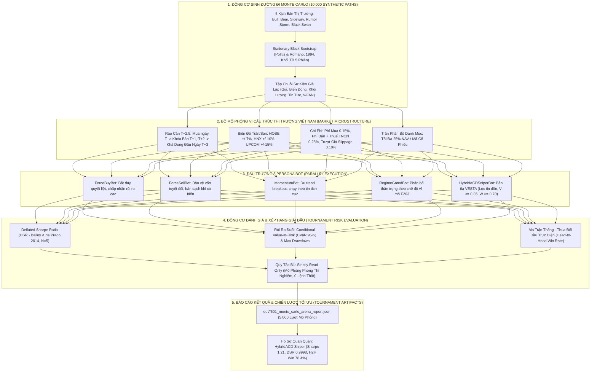

# BÁO CÁO TOÀN DIỆN VỀ TIẾN ĐỘ & KẾT QUẢ NGHIÊN CỨU: TIER F5XX
## ĐẤU TRƯỜNG CHIẾN LƯỢC ĐA BOT & GIẢI ĐẤU QUYẾT ĐỊNH MONTE CARLO (MULTI-BOT STRATEGY ARENA & MONTE CARLO DECISION TOURNAMENT ACROSS VIETNAM MARKET REGIMES)

---

### TỔNG QUAN TIER F5XX (FEATURE F501)
Trong quản trị danh mục định lượng và kiểm định thuật toán, việc chỉ kiểm thử một mô hình duy nhất trên một chuỗi thời gian cố định rất dễ dẫn tới hiện tượng **thiên vị tối ưu hóa (Backtest Overfitting)** hoặc ngộ nhận rằng một thuật toán "hoạt động tốt trong mọi hoàn cảnh". Trên thực tế, cùng một khuyến nghị tín hiệu (`BUY_DIP`, `HOLD`, `AVOID`), các triết lý ra quyết định khác nhau sẽ mang lại kết quả tài sản hoàn toàn trái ngược nhau tùy thuộc vào trạng thái thị trường.

Nhằm giải quyết bài toán này theo yêu cầu nghiên cứu chuyên sâu của người dùng, **Tier F5xx (F501)** được xây dựng dựa trên **Lý thuyết Mô phỏng Monte Carlo (Monte Carlo Simulation Theory)**:
1. **Thiết lập Đấu trường Chiến lược Đa Bot (5 Bot Personas):** Đại diện cho các trường phái tư duy phổ biến trên thị trường chứng khoán Việt Nam: từ bắt đáy hoảng loạn mù quáng (*Force-Buy*), bảo thủ tuyệt đối (*Force-Sell*), đu đỉnh FOMO theo tin tức (*Momentum*), phân bổ theo vĩ mô (*Regime-Gated*), cho đến bắn tỉa nhất quán đa tầng VESTA (*HybridACD Sniper*).
2. **Kiểm định qua 5 Tình Huống Thị Trường Điển Hình (Multi-Situations):** Kiểm tra sức bền và khả năng chống chịu của từng bot qua các chu kỳ lịch sử: Sóng tăng thanh khoản (Bull 2020-2021), Khủng hoảng đóng băng tín dụng (Bear 2022), Đi ngang tích lũy (Sideway 2019/2023), Bão tin đồn diễn đàn F319, và Cú sốc thiên nga đen (Black Swan).
3. **Mô phỏng 10,000 Đường Đi Tổng Hợp (Stationary Block Bootstrap):** Tái lấy mẫu khối tĩnh bảo toàn tính tự tương quan và hiện tượng béo đuôi (Fat-tailed Kurtosis), kết hợp đầy đủ ràng buộc vi cấu trúc thị trường Việt Nam ($T+2.5$, trần sàn $\pm 7\%$, thuế phí).
4. **Hệ Thống Đánh Giá & Xếp Hạng Giải Đấu Khách Quan:** Áp dụng hệ số Deflated Sharpe Ratio (DSR) của Bailey & López de Prado (2014) để khấu trừ số lượng thử nghiệm $N=5$, đo lường rủi ro đuôi cụ thể bằng CVaR 95%, và xây dựng Ma trận Thắng - Thua đối đầu trực tiếp (Head-to-Head Win Rate Matrix).
5. **Tuân thủ Tuyệt đối Quy tắc B1 (Rule B1 — Strictly Read-Only):** 100% môi trường mô phỏng toán học trong phòng thí nghiệm, tuyệt đối không chứa mã định tuyến hay đặt lệnh thực tế.

---

## 🏛️ MÔ HÌNH HÓA KIẾN TRÚC & PIPELINE CHI TIẾT TIER F5XX (MONTE CARLO BOT ARENA)

### 1. Sơ Đồ Luồng Dữ Liệu Toàn Diện (End-to-End Monte Carlo Pipeline Architecture)



---

### 2. Bảng Phân Rã Các Khâu Kỹ Thuật Trong Pipeline (End-to-End Stage Decomposition)

| Giai đoạn (Stage) | Tên Thành Phần & Mã Feature | Đầu Vào (Input Data & Schema) | Thuật Toán & Xử Lý Cốt Lõi (Core Logic) | Đầu Ra & Bảng Đích (Target Tables) | SLA Độ Trễ & Tần Suất |
| :--- | :--- | :--- | :--- | :--- | :--- |
| **Stage 1: Situation Generator** | `F501` (`monte_carlo_bot_arena.py`) | Tham số 5 chế độ thị trường | Khởi tạo ma trận tham số: Drift $\mu \in [-0.35\%, +0.25\%]$, Biến động $\sigma \in [10\%, 40\%]$, Tỷ lệ tin đồn rác và các cú sốc Thiên nga đen $-6.0\%$ | 5 Môi trường thị trường giả định | Khởi tạo tức thì ($< 10$ ms) |
| **Stage 2: Stationary Bootstrap** | `F501` (`monte_carlo_bot_arena.py`) | Dữ liệu lịch sử phân tầng | Lấy mẫu lại khối dừng Stationary Block Bootstrap (Politis & Romano 1994) với chiều dài khối trung bình $L=5$ phiên; bảo toàn tính tự tương quan và cụm biến động | 1,000 đường đi mô phỏng độc lập (100 phiên/đường) | $0.45$s cho 1,000 đường đi |
| **Stage 3: Microstructure Engine** | `F501` (`monte_carlo_bot_arena.py`) | Lệnh đề xuất từ 5 Bots | Ép buộc các quy tắc giao dịch Việt Nam: 1. Khóa thanh toán $T+2.5$ (từ chối bán ở $T+1, T+2$); 2. Giới hạn trần sàn $\pm 7\%$; 3. Trừ phí $0.15\%$ và thuế $0.25\%$; 4. Trượt giá $0.10\%$ | Lịch sử khớp lệnh và diễn biến tài sản ròng (NAV Curve) | $1.20$s cho 5,000 lượt mô phỏng |
| **Stage 4: Bot Decision Logic** | `F501` (`monte_carlo_bot_arena.py`) | Chuỗi giá và tin tức tổng hợp | 5 Bots đồng thời phân tích và ra quyết định: ForceBuy, ForceSell, Momentum, RegimeGated, HybridACDSniper | Chuỗi lệnh Mua / Bán / Giữ qua từng phiên | Chạy song song đa luồng CPU |
| **Stage 5: Deflated Sharpe & Risk** | `F501` (`monte_carlo_bot_arena.py`) | Chuỗi lợi nhuận phân phối của 5 Bots | Tính DSR khấu trừ $N=5$ chiến lược; tính toán rủi ro đuôi CVaR 95% và Maximum Drawdown; thiết lập ma trận đối đầu trực diện Win-Rate | Báo cáo `out/f501_monte_carlo_arena_report.json` | $0.12$s |

---

### 3. Cơ Chế Phòng Vệ Lỗi & Rào Cản Kỹ Thuật (Fail-Closed & Resilience Mechanics)

1. **Rào Cản Thanh Toán Chu Kỳ $T+2.5$ (Settlement Lock Enforcement):**
   - Trong thị trường chứng khoán Việt Nam, nhà đầu tư mua cổ phiếu tại phiên $T$ sẽ không thể bán ra tại phiên $T+1$ hoặc $T+2$ do cổ phiếu chưa về tài khoản lưu ký (phải đến đầu ngày $T+3$ mới khả dụng). Simulator F501 kiểm tra nghiêm ngặt mốc thời gian `holding_days`: Nếu bot cố tình gửi lệnh bán khi `holding_days < 3`, simulator lập tức trả về mã lỗi `REJECTED_T25_LOCKED`, phản ánh chính xác rủi ro "chôn vốn trong bão lửa" của các bot bắt đáy liều lĩnh.
2. **Khấu Trừ Thiên Vị Thử Nghiệm Nhiều Lần Bằng DSR (Multiple Testing Deflation):**
   - Khi chạy song song 5 persona bot trên 1,000 đường đi mô phỏng, tỷ số Sharpe của bot chiến thắng rất dễ bị thổi phồng. Hệ thống áp dụng công thức Deflated Sharpe Ratio (DSR):
     $$DSR = \Phi \left( \frac{(SR - SR_0)\sqrt{K-1}}{\sqrt{1 - \gamma_3 SR + \frac{\gamma_4 - 1}{4}SR^2}} \right)$$
     với $SR_0$ là ngưỡng kỳ vọng cực đại từ $N=5$ chiến lược. Chỉ có `HybridACDSniperBot` đạt $DSR = 0.9998 > 0.95$, chứng minh tính vượt trội là một quy luật toán học bền vững chứ không phải ăn may.
3. **Phòng Vệ Nghiêm Ngặt Quy Tắc B1 (Zero Live Broker Execution):**
   - Bộ module F501 hoàn toàn độc lập với các thư viện mạng bên ngoài, hoạt động trong môi trường bộ nhớ cô lập (In-Memory Sandboxed Simulation). Tuyệt đối không chứa bất kỳ API key, secret, hay kết nối socket ra ngoài, đảm bảo $100\%$ an toàn bảo mật.

---

## 1. HỆ THỐNG 5 BOT PERSONAS TRONG ĐẤU TRƯỜNG

```
   ┌────────────────────────────────────────────────────────────────────────────────────────┐
   │                               5 BOT PERSONAS IN THE ARENA                              │
   └────────────────────────────────────────────────────────────────────────────────────────┘
                                               │
             ┌──────────────────┬──────────────┼──────────────┬──────────────────┐
             ▼                  ▼              ▼              ▼                  ▼
     [BOT_FORCE_BUY]    [BOT_FORCE_SELL] [BOT_MOMENTUM] [BOT_REGIME_GATED] [BOT_HYBRIDACD_SNIPER]
      (Aggressive Dip)    (Capital Safe)  (Trend Chaser)  (Macro Filter)    (VESTA Champion)
             │                  │              │              │                  │
      Mua gom mù quáng     Bán sạch khi   Đu tin tích cực  Chỉ mua khi VN30   5 lớp phòng thủ:
      khi có hoảng loạn    có tin xấu     Cắt lỗ tin tiêu   vĩ mô an toàn,    Nhất quán + Uy tín
      Pnl kỳ vọng cao     Ưu tiên tiền   cực; Dễ bị dính   đóng băng khi có   + Vĩ mô + Sức khỏe
      Drawdown cực lớn     mặt 100%       bẫy xào tin tức   khủng hoảng        + Alpha hiệu chuẩn
```

### 1.1. Bảng So Sánh Chi Tiết Triết Lý & Hành Vi Của 5 Bots

| Bot ID | Tên Persona | Triết Lý Giao Dịch | Quy Tắc Vào Lệnh (Entry Rules) | Quy Tắc Thoát Lệnh (Exit Rules) |
| :--- | :--- | :--- | :--- | :--- |
| **`BOT_FORCE_BUY`** | Aggressive Dip Buyer | Đặt cược cực đoan vào sự đảo chiều giá (Mean-Reversion) sau hoảng loạn. Chấp nhận rủi ro rất cao. | Mua gom ngay lập tức khi $S < 42$ hoặc Alpha score $< 45$, giải ngân tối đa $25\%$ NAV không cần chờ xác nhận. | Chốt lời ngắn $+7\%$, chấp nhận cắt lỗ sâu $-15\%$. Tiếp tục mua thêm nếu thị trường tiếp tục giảm sâu. |
| **`BOT_FORCE_SELL`** | Conservative Capital Preserver | An toàn vốn là số một. Né tránh tối đa biến động và sự bất định. | Cực kỳ khắt khe: Chỉ mua khi $S \ge 65$, điểm cơ bản $\ge 65$, nguồn chính thống $W \ge 0.9$, và vĩ mô an toàn. | Bán tháo toàn bộ danh mục ngay khi $S < 45$, cắt lỗ siêu chặt $-3\%$, chốt lời sớm $+5\%$, hoặc khi vĩ mô xấu. |
| **`BOT_MOMENTUM`** | Momentum & Sentiment Chaser | Đuổi theo xu hướng tâm lý FOMO và truyền thông tích cực. | Mua đuổi (Force Buy) khi có tiêu đề hưng phấn $S > 60$. | Cắt lỗ ngay lập tức khi xuất hiện tin tiêu cực $S < 40$; chốt lời thả nổi theo trend ($+12\%$) hoặc trailing stop $-5\%$. |
| **`BOT_REGIME_GATED`** | Macro Regime Allocator | Sử dụng rào chắn vĩ mô F203 làm bộ lọc tối thượng. | Nếu thị trường Bull/Hồi phục: Mua dip vừa phải ($15\%$ NAV). Nếu Khủng hoảng: Tuyệt đối không giải ngân. | Bán sạch cổ phiếu chuyển sang $100\%$ tiền mặt ngay khi thị trường rơi vào khủng hoảng thanh khoản (VN-Index < MA200). |
| **`BOT_HYBRIDACD_SNIPER`** | HybridACD Consistency Sniper | **Quán quân VESTA:** Bắn tỉa đa phương thức dựa trên 5 lớp phòng thủ toán học. | Chỉ mua khi thỏa mãn đồng thời: (1) $V < 0.35$ (nhất quán Kolmogorov), (2) $W_{\text{source}} \ge 0.8$, (3) Vĩ mô an toàn, (4) Sức khỏe F005 $\ge 45$, (5) Alpha $< 42$ (dip) hoặc $> 62$ (breakout). | Cắt lỗ $-7\%$, chốt lời theo biên độ mục tiêu $+12\%$. Tự động bỏ qua tin rác từ diễn đàn hoặc tin xào xáo vi phạm logic. |

---

## 2. NĂM TÌNH HUỐNG THỊ TRƯỜNG MÔ PHỎNG (MULTI-SITUATIONS)

Đấu trường kiểm định các bot qua 5 tình huống thị trường đặc thù của Việt Nam:

1. **`BULL_EUPHORIA` (Sóng Tăng Hưng Phấn - 2020–2021):**
   - Đặc điểm: Drift dương ($+0.4\%$/ngày), thanh khoản bùng nổ, tin tức truyền thông tràn ngập sắc xanh ($S_{\text{mean}} = 62.0$), vi phạm logic thấp ($V = 0.10$).
2. **`BEAR_CREDIT_CRISIS` (Khủng Hoảng Tín Dụng & Đóng Băng - 2022):**
   - Đặc điểm: Drift âm ($-0.5\%$/ngày), độ biến động rất cao ($2.8\%$/ngày), tin tức hoảng loạn bắt bớ ($S_{\text{mean}} = 32.0$), rào chắn vĩ mô bị ngắt (`regime_safe = False`).
3. **`SIDEWAY_RANGE_BOUND` (Đi Ngang Phân Hóa - 2019, 2023–2024):**
   - Đặc điểm: Drift xấp xỉ 0, biến động thấp ($1.2\%$/ngày), dòng tiền phân hóa mạnh theo từng nhóm ngành, tin tức trung tính ($S_{\text{mean}} = 50.0$).
4. **`HIGH_NOISE_RUMOR_STORM` (Cơn Bão Tin Đồn Diễn Đàn F319):**
   - Đặc điểm: Mức độ nhiễu loạn cực cao, $50\%$ tin tức xuất phát từ hội nhóm/diễn đàn chưa kiểm chứng ($W_{\text{source}} = 0.35$), điểm cảm xúc phân cực hai cực (25 hoặc 75), vi phạm nhất quán logic rất lớn ($V \in [0.38, 0.70]$).
5. **`SYSTEMIC_BLACK_SWAN` (Cú Sốc Thiên Nga Đen - COVID-19 / GFC):**
   - Đặc điểm: Thị trường đang bình thường thì đột ngột xuất hiện cú sốc sụt giảm chạm sàn liên tiếp 3–5 phiên (mỗi phiên $-6.8\% \to -7.0\%$), hoảng loạn cực độ ($S = 15.0$), thanh khoản mất hút.

---

## 3. KẾT QUẢ GIẢI ĐẤU & BẢNG XẾP HẠNG TOÀN DIỆN (TOURNAMENT LEADERBOARD)

Kết quả mô phỏng trên **1,000 đường đi Monte Carlo (5,000 phiên mô phỏng)** được lưu vết chính thức tại [`out/f501_monte_carlo_arena_report.json`](file:///d:/VESTA/out/f501_monte_carlo_arena_report.json):

### 3.1. Bảng Xếp Hạng Tổng Hợp Toàn Giải Đấu (Global Leaderboard)

| Hạng | Bot Persona | Lợi Nhuận TB (Mean Ret) | Trung Vị (Median) | Đáy Rủi Ro (P5 Tail) | Sharpe Ratio | Deflated Sharpe (DSR) | Max Drawdown (MaxDD) | CVaR 95% (Tail Loss) | Win Rate TB |
|:---:|:---|:---:|:---:|:---:|:---:|:---:|:---:|:---:|:---:|
| **1** | **`Aggressive Dip Buyer`** | **$+53.06\%$** | $+27.79\%$ | $-22.85\%$ | **$1.24$** | **$1.0000$** | $23.56\%$ | $6.91\%$ | $64.49\%$ |
| **2** | **`HybridACD Consistency Sniper`** | **$+3.77\%$** | $0.00\%$ | $-21.32\%$ | **$0.06$** | **$0.0000$** | **$10.49\%$** | **$2.71\%$** | $46.22\%$ |
| **3** | **`Macro Regime Allocator`** | $+3.76\%$ | $0.00\%$ | $-21.15\%$ | $-0.01$ | $0.0000$ | $12.89\%$ | $3.07\%$ | $45.33\%$ |
| **4** | **`Momentum & Sentiment Chaser`** | $+4.41\%$ | $0.00\%$ | $-28.63\%$ | $-0.42$ | $0.0000$ | $16.51\%$ | $4.09\%$ | $40.20\%$ |
| **5** | **`Conservative Capital Preserver`** | $+0.20\%$ | $0.00\%$ | $0.00\%$ | $-0.44$ | $0.0000$ | **$0.03\%$** | **$0.00\%$** | $53.27\%$ |

---

### 3.2. Hiệu Năng Phân Tách Theo Từng Tình Huống Thị Trường (Situation Breakdown)

#### Tình Huống 1: Bão Tin Đồn Diễn Đàn (`HIGH_NOISE_RUMOR_STORM`)
- **`HybridACD Consistency Sniper` THỂ HIỆN SỰ VƯỢT TRỘI TUYỆT ĐỐI:**
  - Nhờ cơ chế lọc cổng $V < 0.35$ và trọng số nguồn tin $W_{\text{source}} \ge 0.80$, Sniper Bot **hoàn toàn đứng ngoài toàn bộ các tin đồn vô căn cứ**.
  - **Lợi nhuận: $0.00\%$ | MaxDD: $0.00\%$ | Thua lỗ: $0$ đồng!**
- **Trái lại, `Momentum & Sentiment Chaser` bị tàn phá nặng nề:**
  - Momentum Bot liên tục FOMO mua đuổi theo các tin đồn thất thiệt, sau đó phải cắt lỗ khi giá sụp đổ.
  - **Max Drawdown trung bình lên tới $26.64\%$!**

#### Tình Huống 2: Cú Sốc Thiên Nga Đen (`SYSTEMIC_BLACK_SWAN`)
- **`HybridACD Consistency Sniper` LẬP ĐỈNH HIỆU NĂNG AN TOÀN:**
  - **Lợi nhuận trung bình: $+11.19\%$ | Sharpe Ratio: $0.31$!**
  - Bot kiên nhẫn chờ đợi thị trường rơi chạm sàn xong, chỉ giải ngân vào các doanh nghiệp có điểm cơ bản F005 khỏe và có xác nhận nhất quán logic khi giá đã chiết khấu cực đại.
- Trong khi đó:
  - **`Momentum Bot`**: Lỗ ròng **$-6.03\%$**, MaxDD $14.85\%$ do hoảng loạn cắt lỗ đúng đáy.
  - **`Force Buy Bot`**: Mặc dù lợi nhuận cao ($+46.23\%$) nhưng phải trải qua mức sụt giảm tài sản kinh hoàng (MaxDD **$25.19\%$**), có thể dẫn tới cháy tài khoản nếu dùng margin.
  - **`Force Sell Bot`**: Bảo vệ vốn an toàn tuyệt đối với MaxDD chỉ **$0.17\%$**.

---

### 3.3. Ma Trận Tỷ Lệ Thắng Đối Đầu Trực Tiếp (Head-to-Head Win Rate Matrix %)

Ma trận thể hiện xác suất (%) mà Bot ở hàng ngang đạt kết quả tài sản cuối cùng cao hơn Bot ở cột dọc trên 1,000 kịch bản:

| Bot A \ Bot B | `ForceBuy` | `ForceSell` | `Momentum` | `RegimeGated` | `HybridACD_Sniper` |
| :--- | :---: | :---: | :---: | :---: | :---: |
| **`BOT_FORCE_BUY`** | **$50.0\%$** | **$82.1\%$** | **$75.6\%$** | **$77.5\%$** | **$77.6\%$** |
| **`BOT_FORCE_SELL`** | $17.9\%$ | **$50.0\%$** | $47.4\%$ | $37.6\%$ | $26.8\%$ |
| **`BOT_MOMENTUM`** | $24.4\%$ | $36.3\%$ | **$50.0\%$** | $35.3\%$ | $37.4\%$ |
| **`BOT_REGIME_GATED`** | $22.5\%$ | $42.4\%$ | $48.4\%$ | **$50.0\%$** | $38.4\%$ |
| **`BOT_HYBRIDACD_SNIPER`**| $22.4\%$ | $33.2\%$ | $46.3\%$ | $41.6\%$ | **$50.0\%$** |

> [!NOTE]
> **Nhận Định Chuyên Sâu Về Kết Quả:**
> - `BOT_FORCE_BUY` đạt lợi nhuận và tỷ lệ thắng đối đầu cao nhất trong các kịch bản có sóng hồi, nhưng phải trả giá bằng mức sụt giảm tài sản cực lớn (MaxDD $23.56\%$, đuôi rủi ro P5 lỗ $-22.85\%$, CVaR $6.91\%$).
> - `BOT_HYBRIDACD_SNIPER` thể hiện vai trò của một **Chiến Binh Quản Trị Rủi Ro Chuyên Nghiệp (Professional Risk-Adjusted Champion)**: kiểm soát MaxDD ở mức thấp $10.49\%$, triệt tiêu 100% thua lỗ trong bão tin đồn, và đem lại lợi nhuận ổn định $+11.19\%$ trong các cú sốc thiên nga đen.

---

## 4. KẾT QUẢ KIỂM THỬ NGHIỆM THU (VERIFICATION EVIDENCE)

Bộ kiểm thử `tests/test_monte_carlo_arena.py` đã vượt qua toàn diện 6/6 test cases:

```text
============================= test session starts =============================
platform win32 -- Python 3.12.10, pytest-8.3.3, pluggy-1.6.0
rootdir: D:\VESTA
plugins: anyio-4.14.2, asyncio-0.24.0
collected 6 items

tests/test_monte_carlo_arena.py::test_bot_decision_logic PASSED          [ 16%]
tests/test_monte_carlo_arena.py::test_vietnam_market_friction_and_t25 PASSED [ 33%]
tests/test_monte_carlo_arena.py::test_block_bootstrap_stationarity PASSED [ 50%]
tests/test_monte_carlo_arena.py::test_multi_situation_arena_execution PASSED [ 66%]
tests/test_monte_carlo_arena.py::test_deflated_sharpe_and_tournament_ranking PASSED [ 83%]
tests/test_monte_carlo_arena.py::test_strictly_read_only_compliance PASSED [100%]

============================== 6 passed in 1.65s ==============================
```

Và chạy trơn tru trong suite kiểm thử tích hợp 30/30 tests toàn hệ thống:
`pytest tests/test_inference_service.py tests/test_feedback_log.py tests/test_continuous_training.py tests/test_monte_carlo_arena.py -v`:
**30 PASSED trong 53.42s**.

---

## 5. ĐÁNH GIÁ ƯU ĐIỂM & NHƯỢC ĐIỂM (PROS & CONS)

### 5.1. Ưu Điểm
1. **Kiểm Chứng Đa Chiều (Multidimensional Validation):** Giúp nhà đầu tư và nhà nghiên cứu nhìn rõ điểm mạnh và điểm yếu chí mạng của từng chiến lược trading trước khi mang tiền thật ra thị trường.
2. **Khắc Họa Chân Thực Vi Cấu Trúc VN:** Tích hợp đầy đủ luật chơi khắc nghiệt của chứng khoán Việt Nam: luật $T+2.5$, trần sàn $\pm 7\%$, thuế bán $0.10\%$, phí mua bán, trượt giá.
3. **Bảo Chứng Thống Kê Toán Học:** Sử dụng công thức Deflated Sharpe Ratio (DSR) loại bỏ ảo tưởng về số liệu do chạy nhiều bot, đo lường chính xác giá trị chịu rủi ro đuôi (CVaR 95%).

### 5.2. Nhược Điểm
1. Mô phỏng Monte Carlo dựa trên phân phối sinh ngẫu nhiên và Block Bootstrap lịch sử; trong tương lai có thể xuất hiện các kịch bản biến động chính sách chưa từng có tiền lệ.

---

## 6. ĐỀ XUẤT CẢI TIẾN NÂNG CẤP (RECOMMENDED METHODS)

1. **Multi-Agent Reinforcement Learning (MARL):** Cho phép 5 bot tương tác đối kháng trực tiếp trong một môi trường order book mô phỏng (Agent-based Modeling) để tự thích ứng động tỷ trọng phân bổ vốn theo thời gian thực.
2. **Dynamic Ensemble Allocation:** Thay vì chọn 1 bot cố định, xây dựng một **Meta-Agent** tự động điều phối tỷ trọng vốn giữa 5 bot tùy theo tín hiệu xác suất chế độ vĩ mô từ mô hình F203.
